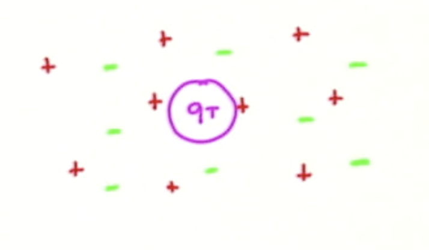

# _1.1_ Definition of Plasma

In order to define plasmas, we will need three definitions: the Debye length, the plasma frequency, and the collision frequency. Rigorously, a plasma is an ionized gas that is **globally neutral** and that displays **collective effects**.

## _1.1.1_ Debye Length

Consider a plasma that is initially electrically neutral. That is, the number of negative charges $` n_e `$  is equal to the number of positive charges $` n_i `$ . We insert a test charge $` q_t `$  within the plasma. 


<p align="center">  </p>

What will be the electrostatic potential around this test charge? We must solve the Poisson equation to determine the potential

```math
\grad ^2 \phi = - \frac{1}{\epsilon_0} \left[ q_t \delta (\vec \gr) + e n_i ( \vec{\gr}) - e n_e ( \vec \gamma)\right]
```

To a first approximation, we treat the ions as a fixed background, since they are very heavy compared to the electrons and do not move.

```math
n_i (\vec \gr) = n_0
```

The equation of motion that governs the motion of the electrons is 

```math
m_e \dv{ \vec{u}_e}{t} = - e \vec{E} - \frac{1}{n_e} \grad P_e =  - e \vec{E} - \frac{1}{n_e} \grad( n_e k_b T_e)
```

where the pressure $` P_e `$ can be written in terms of the temperature and the Boltzmann constant. In order to simplify the notation of plasma physics, we tend to express the temperature in terms of the Boltzmann constant

```math
k_B T_e \rightarrow T_e
```

The temperature is then actually measured in terms of energy (electron volts typically).

Now we can make some hypotheses. First, the electrons are very light, so the respond immediately to changes in the plasma. That is,

```math
m_e \rightarrow 0
```

Second, we will assume that the electric field is given by 

```math
\vec{E} = - \grad \phi
```

Finally, we assume that the electrons are isothermal, so

```math
T_e \approx \text{const.}
```

Putting these together, the equation of motion is

```math
0 \approx e \grad \phi - T_e \frac{\grad n_e}{n_e} \\
\rightarrow 0 \approx \grad \left( e \phi - T_e \ln n_e \right) \\
\rightarrow e \phi - T_e \ln n_e \approx \text{const.} \\
\rightarrow n_e = n_0 e^{\left( \frac{e \phi}{T_e} \right)}
```

So, when there is no electric field, the electron density will be equal to the initial density, as expected. Now, what happens when we insert this density into the Poisson equation we were initially looking at?

```math
\grad ^2 \phi = - \frac{1}{\epsilon_0 } \left[ q_t \delta ( \vec \gamma) + e n_0 - e n_0 e^{\left( \frac{e \phi}{T_e} \right)} \right] 
```

If the perturbations are small, $` e \phi / T_e \ll 1 `$ then the taylor expansion of the exponential gives

```math
\grad ^2 \phi = - \frac{q_t}{\epsilon_0} \delta ( \vec \gamma)+ \frac{e^2 n_0}{\epsilon_0 T_e} \phi = - \frac{q_t \delta ( \vec \gamma) }{\epsilon_0} + \frac{1}{\lambda^2 _{De}} \phi
```

where $` \lambda_{De} `$ is the electron Debye length defined as
```math
\lambda_{De} = \sqrt{ \frac{ \epsilon_0 T_e}{e^2 n_0}}
```

Now we've reduced the problem of determining the potential to

```math
\grad ^2 \phi - \frac{1}{ \lambda ^2 _{De}} \phi = - \frac{q_t}{\epsilon_0} \delta ( \vec \gamma)
```

We can solve this by working in spherical coordinates or look up the solution in our favorite undergrad E&M text

```math
\phi ( \gr) = \frac{1}{4 \pi \epsilon} \frac{q_t}{\gr} e^{- \gamma/ \lambda _{De}}
```

What does this potential look like if we plot it against distance from our test charge?

<p align="center">  </p>

The potential is a combination of the standard Coulomb potential and an exponential factor whose argument is always negative. The effect of the plasma is actually to "screen" the potential that a charged particle would have in vacuum.

In order to describe the plasma, we have used concepts like density, disregarding the fact that the charged particles themselves are discrete. So we used a statistical approach that is valid only if there are a large number of particles within a space characterized by a Debye cube $` \lambda_{De} ^3 `$

```math
 \rightarrow n \lambda_{De} ^3 = N_D \gg 1
``` 

For quick calculations iff we express our temperature in Kelvin and $` n_0 `$ in $` cm^{-3} `$ an estimation of the Debye length is
```math
\lambda _{De} \approx 6.9 \sqrt{T_e / n_0} \, \text{cm}
```

Or, if temperature is in electron volts and $` n_0 `$ in $` m^{-3} `$ then
```math
\lambda_{De} \approx 7 \cdot 10^{3} \sqrt{T_e/n_0} \, \text{m}
```

Conclusions: First, if we want to have deviation from quasi-neutrality, $` n_e = n_0 e^{\frac{e \phi}{T_e}} \neq 0 `$, then $` \gamma\leq \lambda_{De} `$ (This requires to have $` N_D \gg 1 `$. A second conclusion we can draw which is much more important: we assumed that $` \frac{e \phi}{T_e} \ll 1 `$. Does this actually make much sense? $` \phi `$  goes to infinity for $` \gamma= 0 `$. In fact, there is a minimum distance at which looking at our equation makes sense. What we have to do is evaluate the electrostatic potential at the minimal distance that makes sense to look at, where the Debye screening will not have intervened yet. This will given by the typical distance between particles in a plasma:

```math
\gamma_{min} = (1/n_0) ^{1/3}
```

Therefore

```math
\frac{e \phi}{T_e} \approx \frac{1}{4 \pi \epsilon_0} \frac{e^2}{T_3} n_0 ^{1/3} = \frac{1}{4 \pi \epsilon_0} \frac{e^2 n_0}{T_e} \frac{1}{n_{2/3}} \approx \frac{1}{4 \pi} \frac{1}{ \lambda_{De} ^2} \frac{1}{n_0 ^{2/3}} = \frac{1}{4 \pi N_D ^{2/3}} \ll 1
```

From this, we notice that the one-to-one interaction between particles is weak if $` e \phi / T_e \ll 1 `$, that is for $` N_D \gg 1 `$. In other words, if $` N_D `$ is large then the electrostatic potential that acts between two charged particles will be much smaller than the electron temperature, so therefore the one-to-one interaction between particles will be weak.

## _1.1.2_ Plasma Frequency

Let's consider a plasma that's a slab of electrons with number density $` n_0 `$ and a fixed background of the same density. We then displace the electrons with respect to the ions by $` \delta x `$. The Coulomb force will tend to pull the electrons back towards the ions. What is the frequency of the resulting oscillation?

<p align="center">  </p>

We first evaluate the electric field

```math
\pdv{E}{x} = \frac{\rho}{\epsilon_0}
```

We can break the plasma volume into three regions. At the left end (region 1) there are now more ions than electrons, so $` \rho > 0 `$. At the right end (region 3) there are more electrons, so $` \rho < 0 `$. In the middle, the displacement cancels and $` \rho = 0 `$. In region 2

```math
E = \frac{n_0 e \delta x}{\epsilon_0}
```

The equation of motion of the electrons is
```math
m_e \frac{d ^2 \delta x}{dt ^2} = -e E = - \frac{n_0 e^2 }{\epsilon_0} \delta x \\
\rightarrow \frac{d ^2 \delta x}{dt ^2} + \left( \frac{n_0 e^2}{\epsilon_0 m_e} \right ) \delta x = 0 
```

This equation describes an oscillator with frequency

```math
\omega_{pe} = \sqrt{ \frac{n_0 e^2}{\epsilon_0 m_e}}
```

Observation: we can re-write the electron plasma frequency $` \omega_{pe} `$ as

```math
\omega_{pe}  = \sqrt{ \frac{n_0 e^2}{\epsilon_0 m_e}} = \sqrt{ \frac{ n_0 e^2}{\epsilon_0 T_e} \frac{T_e}{m_e}} = \sqrt{ \frac{ n_0 e^2}{\epsilon_0 T_e} } \sqrt{\frac{T_e}{m_e}} = \frac{v_{th,e}}{\lambda_{De}}
```

So there is this relationship between the frequency of the plasma oscillations and the thermal velocity and Debye length.

So about how much is the plasma frequency?

```math
f_{pe} = 8980 \sqrt{n_0}
```

where $` n_0 `$ is expressed as $` cm^{1/3} `$ 

## _1.1.3_ Collision Frequency


First, let's try to remind ourselves how collision processes can be described. Say we have a certain number of target particles $` n_{target} `$ and an electron which moves towards the particles at velocity $` v_{in} `$. The electron sees the target particles each coming towards it with an collision area (cross-section) $` \sigma `$. The frequency of collisions will be

```math
\nu_{coll} = n_{target} \sigma v_{in}
```

What kinds of collisions with our target particles will our electron experience? It could collide with neutral targets, $` \nu_{coll} = n_n v_{th, e} \pi \rho_0 ^2 `$, where $` \pi \rho_0 ^2 `$ is the area of the Bohr radius. 

We can also have Coulomb collisions with other electrons, in which the direction of the electron is deviated by another charged particle. This interaction becomes important when the Coulomb interaction energy is comparable to the kinetic energy. We can estimate the Coulomb interaction energy in terms of the impact parameter $` b `$ (the distance of closest approach). In that case, the Coulomb interaction energy will become important when

```math
\frac{\text{Coulomb interaction energy}}{\text{Kinetic energy}} = \frac{e^2 / r \pi \epsilon_0 b}{m_e v_{th, e}^2} \approx 1 \\
\rightarrow b \approx \frac{e^2}{4 \pi \epsilon_0 m_e v_{th, e}^2} = b_{\pi/2}
```

The frequency of electron-electron collisions will then be

```math
\nu _{coll} = n_e v_{th, e} \pi b_{\pi/2} ^2 = \frac{ \pi n_0 v_{th, e} e^4}{16 \pi ^2 \epsilon_0 ^2 m_e ^2 v_{th, e} ^4} = \frac{n_0 e^4}{16 \pi \epsilon_0 ^2 m_e ^2 v_{th, e} ^3}
```

For the remainder of this section, we'll ignore the neutral collisions, and just look at the electron collisions (which are the most interesting in a plasma).

Now we can put all three of these definitions together to define a regime in which plasmas (as defined at the very beginning of this section) can be found. To refresh your memory, a plasma is "an ionized gas which is globally neutral and displays collective effects." To start with, globally neutral means that the size of the plasma must be much larger than the Debye length. The plasma is quasi-neutral at a scale length $` \geq \lambda_{De} `$ 

```math
\text{globally neutral} \rightarrow \text{size of plasma} \gg \lambda_{D_e}
```

To have collective effects, we want the one-to-one interactions between particles to be weak compared to effects throughout the plasma. As we saw this happens with the number of particles in a Debye cube is much more than 

```math
 N_D \gg 1 \\
 \rightarrow \frac{\omega_{pe}}{v_{coll}} \gg 1 \\
 \rightarrow \sqrt{ \frac{n_0 e^2}{\epsilon_0 m_e}} \frac{16 \pi \epsilon_0 m_e v_{th, e} ^3}{n_0 e^4} \\
= 16 \pi \sqrt{\frac{T_e^3 \epsilon_0 ^3 n_0 ^2}{e^6 n_0 ^3}} \\ 
= 16 \pi \lambda_{De} ^3 n_0 = 16 \pi N_D \gg 1
```

So we have a plasma if we have an ionized gas for which $` N_D \gg 1 `$. We can also introduce a "plasma parameter" $` g `$ 

```math
g = \frac{1}{N_D} \ll 1
```

Where can we find the plasmas we know about? The following chart describes roughly the regions where real plasmas exist.

<p align="center">  </p>

One useful thing to note is that in the range of parameters considered in these real plasmas, we can ignore both relativistic effects and quantum effects. That's lucky, because things are going to be plenty difficult enough :)