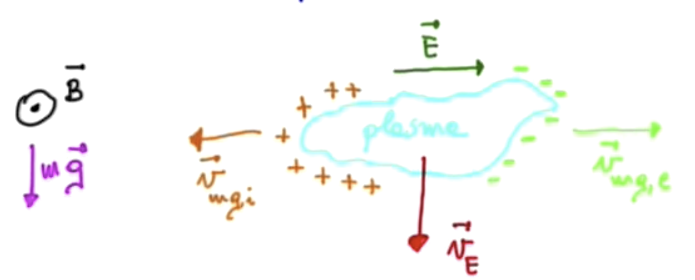

# **1.2** Particle motion in EM fields

Now that you've got a rigorous definition of a plasma, what can you say about the motion of a charged particle within a plasma? Plasmas are made of electrons and ions that move under the effect of EM fields. Those fields are generated self-consistently by the plasma constituents, so if you want to describe a plasma in a self-consistent way, you need to both describe the generation of these EM fields and resultant the motion of the charged particles.

To begin with, start with the simplest cases. Assume that the EM fields are given and watch how a charged particle moves under the given fields. 

## **1.2.1** Motion of a particle in static and uniform magnetic field

In a magnetostatic situation, you must solve

$$
m \dv{\vec v}{t} = q ( \vec v \cross \vec B)
$$

with \( \vec B \) constant. The variation of the kinetic energy is given by

$$
\dv{}{t} \left( \frac{ m v^2}{2} \right) = m \vec v \cdot \dv{\vec v}{t} = m \vec v \cdot \frac{q (\vec v \cross \vec B)}{m} = 0
$$

So \( v^2 \) is constant. Of course, we already knew that magnetic fields can do no work, so that's not surprising at all.It is convenient to to decompose the velocity of the particle along directions parallel and perpendicular to the magnetic field

$$
\vec v = \vec v _{\parallel} + \vec v_{\perp}
$$

$$
\vec v_{\parallel} = ( \vec v \cdot \vec B) \frac{ \vec B}{B^2} \qquad \vec v_{\perp} = \vec v - \vec v_{\parallel}
$$

Projecting the equation of motion onto the parallel direction gives

$$
m \dv{\vec v}{t} \frac{ \vec B}{B} = m \dv{v_{\parallel}}{t} = q ( \vec v \cross \vec B) \cdot \frac{\vec B}{B} = 0 \quad \rightarrow \quad v_{\parallel} = \text{const.}
$$

$$
v^2 = v_{\perp} ^2 + v_{\parallel} ^2 \rightarrow v_{\perp} = \text{const.}
$$

So the derivative of \( v_{\perp} \) is perpendicular to \( v_{\perp} \) and its modulus is constant, so in the perpendicular direction the particle undergoes uniform circular motion with frequency given by the cyclotron frequency

$$
\omega_c = \frac{v_\perp}{m v_{\perp} / |q| B} = \frac{|q| B}{m}
$$

The motion of the particle will be a helical trajectory along the direction of the magnetic field:

  

The handedness of the motion is defined by the charge of the particle. Positively charged particles will move in a left-handed rotation with respect to \( \vec B \), and negatively charged particles will move with right-handed rotation with respect to \( \vec B \).

## **1.2.2** Plasma magnetic properties

Just looking at the simple magnetostatic case of a charged particle we can infer some of the magnetic properties of a plasma. In the presence of a magnetic field a charged particle undergoes uniform circular motion, so it produces a current loop. There is a magnetic moment \( \vec \mu \) associated with a magnetic loop. Some properties of the vector magnetic moment are

 - Its magnitude is  \( | \vec \mu | = I \cdot A = \frac{|q| \omega _c}{2 \pi} \cdot \pi \rho ^2 = \frac{m v_{\perp} ^2}{2 B} = \frac{E_{kin, \perp}}{B} \) 
 - Its direction will be opposite to \( \vec B \) for both \( q > 0 \) and \( q < 0 \).
 - The magnetic field imposed externally will be reduced by the motion of the charged particles in a plasma. In other words, plasmas have **diamagnetic** properties.
 - \( \mu \) is an adiabatic invariant. What do we mean by this? From analytical mechanics, the action \( J = \oint p \dd q \) of a coordinate \( q \) and its conjugate momentum \( p \) is constant under a slow change in an external parameter. This assumes that the motion is periodic if there is no change in an external parameter. Here \( \oint  \) is the integral over one period. This means that the magnetic moment will be constant if the externally applied magnetic field changes more slowly than the period of the particle's cyclotron motion.
     - For the magnetic moment \( \mu \), \( q = x \) (in the direction perpendicular to the externally applied B) and \( p = m v_x \).
    $$
    J = \oint m v_x \, \dd x = \oint m v_x \dv{x}{t} = \oint m v_x ^2 \dd t 
    $$
    $$
    = \int_0 ^{2 \pi / \omega_c} m v_{\perp} ^2 \sin ^2 ( \omega _c t + \phi) \dd t
    $$
    $$
    = \frac{\pi m v_{\perp} ^2}{\omega_c} = \frac{2 \pi m}{|q|} \left( \frac{m v_{\perp}^2}{2 b} \right)
    $$
    $$
    = \frac{2 \pi m}{|q|} \mu
    $$

## **1.2.3** Motion of a particle in static and uniform E and B

First thing's first. Let's write down Newton's equation for a charged particle \( q \) under the influence of static electric and magnetic fields

$$
m \dv{\vec v}{t} = q ( \vec E + \vec v \cross \vec B)
$$

Breaking it apart into directions parallel and perpendicular to the magnetic field,

- Parallel direction: 
$$
m \dv{\vec v _{\parallel}}{t} = q E_{\parallel}
$$
This is just the equation for uniformly accelerated motion, so the parallel direction is very simple.

- Perpendicular direction:
$$
m \dv{\vec v _{\perp}}{t} = q ( \vec E_{\perp} + v_{\perp} \cross \vec B)
$$

To get a feel for what happens in the perpendicular direction, let's assume a simple case in which  \( \vec E \) points upwards, and \( \vec B \) points out of the page (they are \( \perp \) to each other). We also assume that the particle starts at rest. Initially, it will be accelerated in the direction of the electric field. As it gains velocity, the magnetic field will curve the trajectory clockwise. When the particle turns around and opposes the electric field, it will slow down, and the Larmor radius will decrease accordingly. A "guiding center" of the particle's motion will move in a direction perpendicular to both the electric field and the magnetic field. Interestingly, the direction of motion of the guiding center is the same for both positively and negatively charged particles.

  

Let's try to understand what the drift of the guiding center looks like. Averaging the perpendicular equation of motion over one gyroperiod:

$$
\langle m \dv{v_\perp}{t} \rangle = q \langle \vec E_\perp + \vec v_{\perp} \cross \vec B \rangle = 0
$$
$$
\rightarrow \langle v_{\perp} \cross \vec B = - \vec E_{\perp}
$$
Taking the cross-product with the magnetic field,
$$
\langle \vec v_{\perp} \rangle \cross \vec B \cross \vec B = - \langle v_{\perp} \rangle B^2 = - \vec E_\perp \cross \vec B
$$
$$
\rightarrow \langle v_{\perp} \rangle = \frac{\vec E_{\perp} \cross \vec B}{B^2}
$$

While we're in the business of decomposing our directions, we can write \( \vec v_{\perp} \) as a composition of this drift velocity and some "perturbation" velocity \( \vec v_{\perp} ' \)

$$
\vec v_{\perp} = \vec v_{E} + \vec v_{\perp} '
$$ 
$$
\rightarrow m \dv{\vec v_{\perp}'}{t} = q E_{\perp} + q \vec v_{E} \cross \vec B + q v_{\perp} ' \cross B = q E_{\perp} + q \frac{ E_{\perp} \cross B}{B^2} \cross B + q v_{\perp}' \cross B = q v_{\perp} ' \cross B
$$

So the motion of a charged particle in the presence of static E and B fields is given by the superposition of gyromotion, uniform E acceleration, and drift motion of the guiding center \( v_{E} = \frac{E_{\perp} \cross B}{B^2} \). The drift direction is independent of the sign of charge. The guiding center will move along isocontour lines of the electrostatic potential:

  

## **1.2.4** Motion of a particle in uniform B with arbitrary external force

We can easily generalize our drift velocity result to the case of an arbitrary external force \( \vec F \) on top of the Lorentz force.

$$
m \dv {\vec v}{t} = \vec F + q \vec v \cross \vec B
$$
$$
\rightarrow \vec v _{F} = \frac{ \vec F_{\perp} \cross \vec B}{q B^2} \quad \text{(drift)}
$$

!!! question "Application: Gravitational Force"
    
    By applying what we know about the drift velocity, what can we say about the behavior of a plasma under the influence of gravity and a magnetic field? Will it fall?

    Initially, the drift velocity will be perpendicular to both \( \vec B \) and \( m \vec g \), so it will be horizontal and the plasma will not fall. However, the direction of the drift velocity will be opposite for positive and negatively charged particles. This will lead to a charge buildup, which causes an electric field \( \vec E \)  across the plasma. The drift velocity resulting from \( \vec E \) and \( \vec B \) is now pointing downwards, and is in the same direction for both positively and negatively charged particles. Therefore, the plasma will fall downwards under the influence of gravity, but under a much more complicated process than it would initially seem.

    
  

!!! question "Application: Curvature Drift"

    What if we have a curved \( \vec B \)? A particle moving in a curved magnetic field tries to follow the field lines, since motion \( \perp \) to \( \vec B \) is resisted. The particle will experience a centrifugal force
    $$
    F_{c} = \frac{m v_{\parallel}^2}{R_B ^2} \vec R_B
    $$
    
  

    And as a result, it will drift:
    $$
    \vec v_{d} = \frac{\vec F_C \cross \vec B}{q B^2} = \frac{m v_{\parallel ^2}}{q B^2 R_B ^2} ( \vec R_B \cross \vec B) \quad \text{curvature drift}
    $$
    It turns out that this **curvature drift** is a very important quantity in plasma physics.

## **1.2.5** Gradient Drift (non-uniform B)

Now, what if our particle moves in a region of non-uniform \( \vec B \)? Once again, the motion of the particle will follow a guiding center, with a periodic perturbation motion atop. The calculation of the velocity of the guiding center is quite complicated, but the result is

$$
\vec v_{\grad \vec B} = \frac{m v^2}{2 qB^3} ( \vec B \cross \grad \vec B)
$$
This is what is called the **"grad-B drift"**.