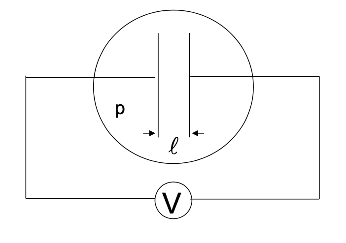
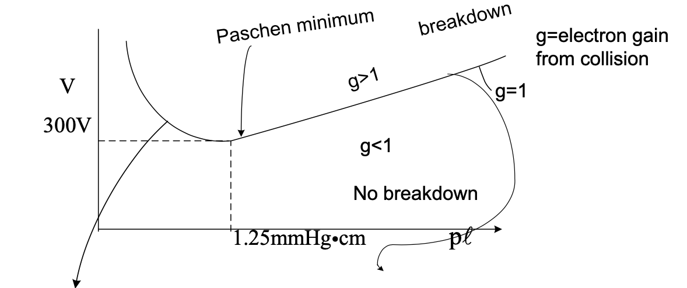

# Collisions

If \( \Lambda \) is large, then small-angle scattering dominates.

$$
\nu = \frac{n}{2 \pi \epsilon_0 ^2} \frac{ e^4}{m^2 v_0 ^3} \ln \Alpha \propto \frac{n}{T^{3/2} m^{1/2}}
$$

## Paschen curve for breakdown

Say we have two large parallel plates

  

  

You can stay on the g=1 curve by putting a large resistor on your power supply, so it's always running like it's about to break down. Neutral-dominated plasma (neutral resistance).

To the left of the Paschen minimum, the spacing is less than the mean free path. There are surface losses. Electron loss to wall.

To the right of the Paschen minimum, there's a fairly linear region with

- Local losses
- There is a certain \( \Delta V \) required between collisions that must be large enough to generate another electron before the electron is lost (\( l \) = spacing between the plates, \( l_{mfp} \) = mean free path
    $$
    \Delta V = E l_{mfp} = \frac{V}{l} l_{mfp} \qquad l_{mfp} \propto \frac{1}{n} \propto \frac{1}{p}
    $$
    If you solve, 
    $$
    \Delta V = \frac{V}{l p} \cdot \text{const.}
    $$
    $$
    V = p l \left( \frac{\Delta V}{\text{const.}} \right) = p l \cdot \text{const.}
    $$

\( g = 1 \) is used for voltage regulation.