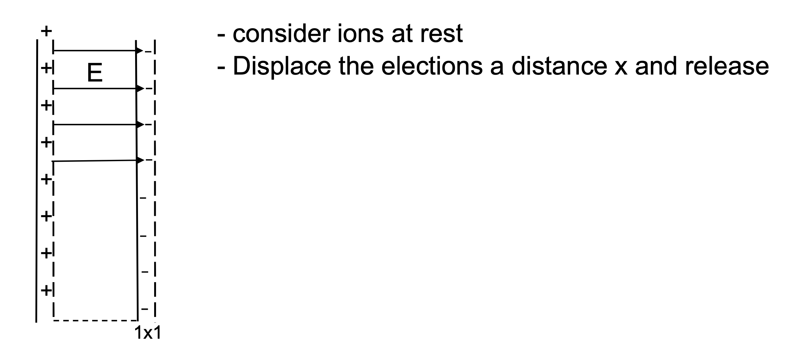

# Oscillations

## Collision Frequencies

Gases have three degrees of freedom to oscillate, but plasmas have four: the electron fluid adds an additional parameter. 

One way to see how the electron fluid oscillates, take a region of plasma and displace the electrons by a distance \( x \) and release. Then, watch how the electrons oscillate.

  

Gauss's law gives the resulting electric field (same as a parallel-plate capacitor.

$$
E = \frac{n e x}{\epsilon_0}
$$

The restoring force is therefore

$$
F = \frac{x n e^2}{\epsilon_0}
$$

We know forces of that form. When released, it will undergo simple harmonic motion

$$
\omega = \sqrt{\frac{K}{m}} \qquad K = \frac{ ne^2}{\epsilon_0}
$$

We define the plasma frequency as

$$
\omega_{pe} = \sqrt{ \frac{ne^2}{m_e \epsilon_0}}
$$

If we take the displacement out to \( \lambda_D \) then the peak velocity is the electron thermal speed \( v_e \) 

$$
\omega_{pe} \lambda_D = v_e
$$

Taking a look back at the collision frequencies, the electron-electron collision frequency \( \nu_{ee} \) (associated with the energy transfer) is close to the electron-ion collision frequency \( \nu_{ei} \) associated with momentum transfer, and both are about

$$
\nu_{ee} \approx \nu_{ei} \approx \frac{v_e}{\lambda_D \Lambda} = \frac{\omega_{pe}}{\Lambda}
$$

So the electron-electron collision frequency will be much less than the plasma frequency if \( \Lambda \gg 1 \) 

$$
\Lambda \gg 1 \rightarrow \nu_{ee} \ll \omega_{pe}
$$

## Definition of Plasma

Some basic criteria for plasma are

$$
L \gg \lambda_D \qquad \text{ (neutral plasma) }
$$
$$
\Lambda \gg 1 \qquad (\omega_{pe} \gg \nu_{ei}
$$
$$
\nu_{en} < \omega_{pe} \quad \text{(if neutrals)}
$$

The collision frequencies have the following meanings:

- \( \nu_{ei} \) - Electron momentum loss rate on ions. Used in resistivity.
- \( \nu_{ee} \) Electron energy exchange rate with electrons. In other words, if you do something to the electrons this is how long it will take to get back to Maxwellian. Same order as \( \nu_{ei} \) 
- \( \nu_{ii} \) Ion energy exchange rate with ions
- \( \nu_{ie} \) Electron energy exchange rate between electrons and ions. It's about the same as ions slowing down in electrons: \( \approx \frac{m_e}{m_i} \nu_{ee} \). For fusion to work, need confinement times longer than this time.

## Electrical Resistivity

Place a plasma of density $n$ in an electric field (generated by voltage difference V). Electrons accelerate in one direction and ions in the other

$$
\Delta p = F \cdot \Delta t
$$
Electrons and ions both get accelerated then collide and both stop since they had equal and opposite momentum
$$
\Delta w = F \cdot \text{distance}
$$
The energy transfer will be much higher for the electrons because of their lower mass. So the electrons carry the current and receive ohmic heating for the resistive part of impedance

$$
\langle m_i v_i \rangle = - \langle m_e v_e \rangle \rightarrow v_e \gg v_i
$$

The approx current is given by the drift velocity \( v_d \) by disregarding the velocity of the ions:

$$
j = - n e \langle v_e \rangle + n e \langle v_i \rangle \approx - n e \langle v_e \rangle  =  |n e v_d|
$$

Identifying the resistivity with Ohm's law

$$
E = \eta j
$$

The force on the electrons is the rate at which momentum is lost by the electrons, which is the drift velocity times the electron-ion collision rate:

$$
F_{elec} = E e = m v_d \nu_{ei} = \text{momentum loss rate}
$$

$$
\rightarrow \eta j = E = \frac{m_e \nu_{ei} n e v_d}{n e^2}
$$
$$
\rightarrow \eta = \frac{m_e \nu_{ei}}{n e^2}
$$

Recall the collision frequency

$$
\nu_{ei} = \frac{n}{2 \pi} \frac{e^4}{\epsilon_0 ^2 m^2 v_0 ^2} \ln \Lambda
$$
$$
\eta = \frac{m_e}{n e^2} \frac{n}{2 \pi \epsilon_0 ^2} \frac{Z_{eff}}{m_e ^2} \frac{e^4}{v^3 _0} \ln \Lambda
$$

The velocity is given by the electron thermal speed
$$
v_0 ^3 \propto \left( \frac{ T_e}{m_e} \right) ^{3/2}
$$

The densities cancel and we can plug in some values

$$
\eta = 5 \cdot 10^{-5} \frac{\ln \Lambda}{T_e ^{3/2}} \qquad \text{(Hydrogen)}
$$

## Magnetic Decay Time

The magnetic decay time for parallel current. For current parallel to the magnetic field, the curl of B is just some multiple \( \lambda \)  of B:

$$
\curl B = \lambda B = \mu_0 j = \mu_0 \frac{E}{\eta} \rightarrow E = \frac{\lambda \eta B}{\mu_0}
$$

$$
\curl E = - \pdv{B}{t}
$$

$$
\rightarrow \curl \frac{\eta \lambda}{\mu_0 } B = - \pdv{B}{t}
$$

This tells you the rate of decay of the magnetic field when you have helicity. The relevant timescale of the decay is

$$
\frac{\eta \lambda^2 B}{\mu_0} = - \dv{B}{t} \rightarrow \tau = \frac{\mu_0}{\eta \lambda^2}
$$

## Thermal Conductivity

Consider a region of space where we have a hot side and a cold side. There is a heat flux \( Q \) flowing from the hot to the cold side

$$
Q = \frac{\text{power}}{\text{area}}
$$ 

The thermal conductivity \( \kappa \) is defined by
$$
Q \equiv - \kappa \pdv{T}{z}
$$

If the energy/particle going up / going down is \( \varepsilon \) 
$$
Q = \varepsilon _0 n_{down} v_{down} - \varepsilon _+ n_{up} v_{up}
$$

For mass conservation we must have

$$
n_{down} v_{down} = n_{up} v_{up} = nv
$$

$$
Q = \varepsilon _0 n v - \varepsilon_+ nv
$$

If we're calculating the heat flux at some position \( z \) and the mean free path is \( l \) then particles come from about a mean free path distance. The energy dependence on \( z \) is given as \( \varepsilon(z) \) 

$$
Q \approx n v \left[ \varepsilon (z - l) - \varepsilon(z + l) \right]
$$
$$
\rightarrow Q \approx n v \left[ \left(\varepsilon (z) - l \pdv{\varepsilon}{z}\right) - \left(\varepsilon(z) + l \pdv{\varepsilon}{z}\right) \right]
$$
$$
\approx - n v l \pdv{\varepsilon}{z}
$$

The Maxwell-Boltzmann energy of the particles is

$$
\varepsilon (z) = k T(z)
$$
$$
Q \approx - n v l k \pdv{T}{z}
$$
$$
\kappa = knv l_{mfp}
$$

Now we plug in the mean free path

$$
l_{mfp} = v t_c = \frac{v}{\nu} \approx \frac{(k T)^{1/2} T^{2/3} m^{1/2}}{m^{1/2} n \ln \Lambda}
$$
$$
\rightarrow \kappa \sim \frac{T^{5/2}}{m^{1/2} \ln \Lambda} \sim \frac{T^{5/2}}{m^{1/2}} 
$$