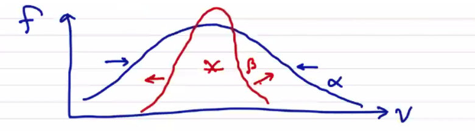

# Plasma Fluid Model

We take velocity moments of each of the pieces of the kinetic model:
  - distribution function, $` f_\alpha `$ $` \rightarrow `$ fluid variables
  - Boltzmann Equation $` \rightarrow `$ governing equations describing the evolution of the fluid variables.

Starting with the zeroth moment (integral) of the distribution function:

```math
\int f_\alpha (\vec x, \vec v, t) \dd \vec v = n_\alpha(\vec x, t)
```

1st Moment (momentum):

```math
m_\alpha \int \vec v \cdot  f_\alpha(\vec x, \vec v, t) \dd \vec v = \vec p_\alpha (\vec x, t) = m_\alpha n_\alpha \vec v_\alpha
```

which is to say that the velocity is the 1st moment divided by the zeroth moment

```math
v_\alpha = \frac{\int \vec v f_\alpha}{\int f_\alpha}
```

2nd Moment:

```math
\int \vec v \vec v f_\alpha (\vec x, \vec v, t) \dd \vec v = \vec E_\alpha(\vec x, t) (\text{energy tensor})
```

We can simplify the 2nd moment by taking a reduced 2nd moment. This means that we're going to insert a dot product

```math
\int \vec v \cdot \vec v f_\alpha (\vec x, \vec v, t) \dd \vec v
```

Before moving forward, we want to define a "random" velocity. Note that

```math
\int \vec v f_\alpha - \vec v_\alpha \int f_\alpha = 0 \rightarrow \int (\vec v - \vec v_\alpha) f_\alpha \dd \vec v = 0
```

We can define a random velocity $` \vec w = \vec v - \vec v_\alpha `$. It is random in the sense that it is a fluctuation about the mean velocity, and when we integrate it we get zero. We can use this to define the energy tensor using the mean velocity to get a meaningful result. The pressure tensor is the second moment, using the random velocity

```math
\vec P_\alpha = m_\alpha \int \vec w \vec w f_\alpha \dd \vec v = P_\alpha \overline{I} + \overline{\Pi}_\alpha
```

where we've decomposed the pressure into an isotropic value $` P_\alpha `$ and what's called the Braginskii stress tensor $` \overline{\Pi}_\alpha `$. The average isotropic pressure is given by the reduced 2nd moment:

```math
P_\alpha = n_\alpha T_\alpha = \frac{1}{3} \int m_\alpha \vec w \cdot \vec w f_\alpha
```

where the factor of $` 1/3 `$ comes from the number of degrees of freedom in our system. It is related to the thermodynamic factor $` \gamma `$ where $` \gamma = \frac{DOF + 2}{DOF} `$. Now we can define the temperature $` T_\alpha `$ as

```math
T_\alpha (\vec x, t) = \frac{1}{DOF} \frac{\int m_\alpha \vec w \cdot \vec w f_\alpha \dd \vec v}{\int f_\alpha \dd \vec v}
```

Now that we've got $` n_\alpha `$, $` v_\alpha `$, and $` T_\alpha `$ we have what we need to define a Maxwellian distribution. Higher moments would be required to describe non-Maxwellian distribution functions. For example, the 3rd moment is called the skewness of the distribution. The 4th moment is the kurtosis. So on and so forth. These give a measure of degree of departure from a Maxwellian distribution, in which case it is often more useful to talk about the excess kurtosis, where the excess kurtosis of a Maxwellian is defined to be zero. You can continue to calculate the moment expansion, and in general it requires an infinite number of moments to describe an arbitrary distribution function. Because of the Boltzmann H-theorem and the tendency of plasmas to quickly relax to Maxwellian, we can usually get away with using just the first three moments.

Now, what are the governing equations? We get these by taking moments of the Boltzmann equation. Let's proceed carefully in sections, so we'll integrate each piece of the BE in terms.

### 0th Moment of Boltzmann Equation (Conservation)

```math
\int \pdv{f_\alpha}{t} \dd \vec v + \int \vec v \cdot \pdv{f_\alpha}{x} \dd v + \int \frac{q_\alpha}{m_\alpha} (\vec E + \vec v \cross \vec B) \cdot \pdv{f_\alpha}{\vec v} \dd \vec v = \int \left. \pdv{f_\alpha}{t} \right|_{coll} \dd \vec v
```

First, we take $` \int \pdv{f_\alpha}{t} \dd \vec v `$. Because t and v are both independent variables, with an argument of sufficient smoothness we can reverse the order of integration and differentiation

```math
\int \pdv{f_\alpha}{t} \dd \vec v = \pdv{}{t}\int f_\alpha \dd v = \pdv{n_\alpha}{t}
```

For $`  \int \vec v \cdot \pdv{f_\alpha}{x} \dd v `$ we can perform an integration by parts

```math
 \int \vec v \cdot \pdv{f_\alpha}{x} \dd v = \int \pdv{}{\vec x} \cdot ( \vec v f_\alpha) \dd \vec v - \int f_\alpha \pdv{}{\vec x} \cdot \vec v \dd \vec v \\
 = \int \pdv{}{\vec x} \cdot ( \vec v f_\alpha) \dd \vec v  \\
 = \pdv{}{\vec x} \cdot \int \vec v f_\alpha \dd \vec v \\
 = \pdv{}{\vec x} \cdot (n_\alpha \vec v_\alpha) = \div (n_\alpha \vec v_\alpha)
```

Once again, we've switched the order of integration of $` x `$  and $` v `$, which we can only do because we have specified that $` f `$ is a distribution function, and as such meets the criterion of sufficient smoothness.

For the last part, we can write it as a surface integral

```math
\int \frac{q_\alpha}{m_\alpha} (\vec E + \vec v \cross \vec B) \cdot \pdv{f_\alpha}{\vec v} \dd \vec v = \oint f_\alpha \frac{q_\alpha}{m_\alpha} ( \vec E + \vec v \cross \vec B) \cdot \dd S_v - \int \frac{q_\alpha}{m_\alpha} f_\alpha \pdv{}{\vec v} \cdot (\vec E + \vec v \cross \vec B) \dd \vec v
```

For $` f_\alpha `$ to be well-defined, we require $` \lim_{v \rightarrow \infty} v^3 f_\alpha = 0 `$ so the surface term vanishes and we're left with

```math
\int \frac{q_\alpha}{m_\alpha} (\vec E + \vec v \cross \vec B) \cdot \pdv{f_\alpha}{\vec v} \dd \vec v = - \int \frac{q_\alpha}{m_\alpha} f_\alpha \pdv{}{\vec v} \cdot (\vec E + \vec v \cross \vec B) \dd \vec v 
```

Distributing the divergence through, 

```math
\pdv{}{\vec v} \cdot \vec E = 0
```
because $` \vec E `$ is independent of $` \vec v `$.

```math
\pdv{}{\vec v} \cdot ( \vec v \cross \vec B) = 0
```
because $` \vec v \cross \vec B `$ is always orthogonal to $` \vec v `$.

We've been working through this in normal vector notation for familiarity, but there is another notation known as Einstein Tensor Notation using the lovely Levi-Civita symbol $` \epsilon_{ijk} `$.

```math
\epsilon_{ijk} = 1 \qquad \text{even permutations of i j k} \\
 = -1 \qquad \text{odd permutations of i j k} \\
= 0 \qquad \text{any repeated indexes}
```


We can write out vector products as products of indices and operators, and any repeated indices are implicitly summed:

```math
\vec v \cross \vec B = \epsilon_{ijk} v_j B_k = \sum_{jk} \epsilon_{ijk} v_j B_k
```

where $` \epsilon_{ijk} `$ is defined to be 1 for even permutations of ijk, -1 for negative permutations if ijk, and 0 for any repeated indices.

We can now write the derivative with respect to $` \vec v `$ as

```math
\pdv{}{\vec v} \cdot \vec v \cross \vec B = \partial _{v_i} \epsilon_{ijk} v_j B_k \\
= \epsilon_{ijk} (\partial_{v_i} v_j) B_k
```

We see that we're taking the derivative of the j-th component of velocity with respect to the i-th component of velocity, and _that's_ how we can most easily point out that the quantity is zero without relying on properties of 3-vector products.

We'll also want to use the divergence in Einstein tensor notation

```math
\div \vec A = \partial_i A_j \delta_{ij} = \partial_i A_i
```

Finally, we come back to the collision term in the zeroth moment of the B-M equation

```math
\sum_\beta \int C_{\alpha \beta} \dd \vec v = 0
```

We can say the collision term is zero by making a physical argument, rather than a mathematical one. We assert that collisions cannot create or destroy particles. This assumption is now baked into our equations going forward, but is not always true! Ionization, recombination, fusion reactions all create/destroy species.

Finally, we've got

```math
\pdv{n_\alpha}{t} + \div ( n_\alpha \vec v_\alpha) = 0 \qquad \text{continuity equation}
```

So by taking the 0th moment of the Boltzmann Equation, we've arrived at the continuity equation for $` n_\alpha `$ by introducing $` \vec v_\alpha `$.

### 1st Moment of Boltzmann Equation

```math
\int \vec v \pdv{f_\alpha}{t} \dd \vec v + \int \vec v \vec v  \pdv{f_\alpha}{\vec x} \dd \vec v + \int \vec v \frac{q_\alpha}{m_\alpha} (\vec E + \vec v \cross \vec B) \cdot \pdv{f_\alpha}{\vec v} \dd \vec v = \int \left. \vec v \pdv{f_\alpha}{t} \right|_{coll}
```

Term 1:

```math
\int \vec v \pdv{f_\alpha}{t} \dd \vec v = \pdv{}{t} \int \vec v f_\alpha \dd \vec v - \int \pdv{\vec v}{t} f_\alpha \dd \vec v \\
= \pdv{}{t} \left( n_\alpha \vec v_\alpha \right)
```

Before we get to the second term, let's have an aside about dyad math. An outer product $` \vec A \vec B `$ gives a second-rank tensor. In Cartesian coordinates, it looks like

```math
\vec A \vec B = \begin{bmatrix}
A_x B_x & A_x B_y & A_x B_z \\
A_y B_x & A_y B_y & A_y B_z \\
A_z B_x & A_z B_y & A_z B_z \\
 \end{bmatrix}
```

A useful property to do with dot products:

```math
\vec A \vec B \cdot \vec C = \vec A ( \vec B \cdot \vec C ) = (\vec A \vec B) \cdot \vec C
```

```math
( \vec V \cdot \grad) \vec B = \vec V \cdot ( \grad \vec B)
```

Back to term 2:

```math
\int \vec v \vec v \cdot \pdv{f_\alpha}{\vec x} \dd \vec v = \int \vec v \cdot \pdv{}{\vec x} ( \vec v f_\alpha) \dd \vec v - \int \vec v f_\alpha \pdv{}{\vec x} \cdot \vec v \dd \vec v \\
 = \int \pdv{}{\vec x} \cdot ( \vec v \vec v f_\alpha) \dd \vec v - \int \vec v f_\alpha \cdot \pdv{\vec v}{\vec x} \dd \vec v \\
 = \pdv{}{\vec x} \cdot \int \vec v \vec v f_\alpha \dd \vec v
```

Re-expanding in terms of random velocity $` \vec v = \vec v_\alpha + \vec w `$

```math
= \pdv{}{\vec x} \cdot \int (\vec v_\alpha + \vec w) (\vec v_\alpha + \vec w) f_\alpha \dd \vec v \\
= \pdv{}{\vec x} \cdot \int (\vec v_\alpha \vec v_\alpha + \vec v_\alpha \vec w + \vec w \vec v_\alpha  + \vec w \vec w)  f_\alpha \dd \vec v \\
= \pdv{}{\vec x} \cdot \left[ \vec v_\alpha \vec v_\alpha \int f_\alpha \dd \vec v + \vec v_\alpha \int \vec w f_\alpha \dd \vec v + \left( \int \vec w f_\alpha \dd \vec v \right) \vec v_\alpha + \int \vec w \vec w f_\alpha f_\alpha \dd \vec v \right]
```

The middle two terms are zero by the very definition of $` \vec v_\alpha `$. The random velocity $` \vec w `$ is defined such that the integral of the random velocity over all phase space is zero.

```math
= \pdv{}{\vec x} \cdot \left( \vec v_\alpha \vec v_\alpha n_\alpha \right) + \pdv{}{\vec x} \cdot \frac{ \vec P_\alpha}{m_\alpha} \\
= \div (n_\alpha \vec v_\alpha \vec v_\alpha) + \frac{1}{m_\alpha} \div \vec P_\alpha
```

Substituting in the pressure tensor,

```math
= \div ( n_\alpha \vec v_\alpha \vec v_\alpha ) + \frac{1}{m_\alpha} \left( \grad P_\alpha  + \div \vec \Pi _\alpha \right)
```

Moving on to term 3:

```math
\int \vec v \frac{q_\alpha}{m_\alpha} (\vec E + \vec v \cross \vec B) \cdot \pdv{f_\alpha}{\vec v} \dd \vec v = \int \frac{q_\alpha}{m_\alpha} \pdv{}{\vec v} \cdot \left[( \vec E + \vec v \cross \vec B) f_\alpha \right] \vec v \dd \vec v - \int \frac{q_\alpha}{m_\alpha} f_\alpha \pdv{}{\vec v} \cdot \left[ \vec E + \vec v \cross \vec B \right] \vec v \dd \vec v \\
= \int \frac{q_\alpha}{m_\alpha} \pdv{}{\vec v} \cdot \left[ f_\alpha (\vec E + \vec v \cross \vec B) \vec v \right] \dd \vec v - \int \frac{q\alpha}{m\alpha} f ( \vec E + \vec v\alpha \cross \vec B) \cdot \pdv{\vec v}{\vec v} \dd \vec v \\
= \frac{q\alpha}{m\alpha} \oint f\alpha ( \vec E + \vec v\alpha \cross \vec B) \vec v \cdot \dd \vec S_v - \frac{q\alpha}{m\alpha} \left[ \vec E \int f \dd \vec v\alpha - \vec B \cross \int \vec v f\alpha \dd \vec v \right] \\
= - \frac{q\alpha}{m\alpha} n\alpha (\vec E + v\alpha \cross \vec B)
```

Finally, the 4th term gives

```math
 \int \left. \vec v \pdv{f_\alpha}{t} \right|_{coll} = \sum_\beta \int \vec v C_{\alpha \beta} \dd \vec v \\
= \int \vec v C_{\alpha \alpha} \dd \vec v + \sum_{\beta \neq \alpha} \int \vec v C_{\alpha \beta} \dd \vec v
```

Collisions of like particles $` \alpha `$ do not result in a net change of momentum of species $` \alpha `$, so all we have left is the change in momentum due to collisions of unlike particles

```math
= \sum_{\beta \neq \alpha} \left[ \vec v_{\alpha} \int C_{\alpha \beta} \dd \vec v + \int \vec w C_{\alpha \beta} \dd \vec v \right]
```

For the same reason as before, we assert that collisions between particles $` \alpha `$  and $` \beta `$  do not lead to the creation or destruction of any species, so the 0th moment $` \int C_{\alpha \beta} \dd \vec v = 0`$. This leads to the conclusion that only random motion contributes to momentum transfer, not $` \vec v_\alpha `$. Viscosity and friction are good examples of similar physical processes where bulk velocity does not transfer momentum, but random motion does.

The momentum transfer from $` \alpha `$  to $` \beta `$ must equal transfer from $` \beta `$ to $` \alpha `$. Momentum is globally conserved.

```math
\int \vec w C_{\alpha \beta} \dd \vec v = - \int \vec w C_{\beta \alpha} \dd \vec v
```

Now we can finally write out the full momentum equation

```math
\pdv{}{t} (n_\alpha \vec v_\alpha ) + \div (n_\alpha \vec v_\alpha \vec v_\alpha) + \frac{1}{m_\alpha} \div \vec P_\alpha - \frac{q_\alpha}{m_\alpha} n_\alpha ( \vec E + \vec v _\alpha \cross \vec B) = \sum_{\beta \neq \alpha} \int \vec w C_{\alpha \beta} \dd \vec v
```

The collision term is often represented as the momentum transfer vector $` \vec R_{\alpha \beta} `$ to $` \alpha `$ from $` \beta `$.

```math
\vec R_{\alpha \beta} \equiv m_\alpha \int \vec w C_{\alpha \beta} \dd \vec v
```
```math
\pdv{}{t} (m_\alpha n_\alpha v_\alpha) + \div (m_\alpha n_\alpha \vec v_\alpha \vec v_\alpha) + \grad \vec P_{\alpha} + \div \vec \Pi_{\alpha} - q_\alpha n_\alpha (\vec E + \vec v _\alpha \cross \vec B) = \sum_{\beta} R_{\alpha \beta}
```

Once again, we've written the above in a conservation law form. The terms that aren't strictly conservation terms are the source term $` q_\alpha n_\alpha (\vec E + \vec v _\alpha \cross \vec B) `$ and sink term $` \sum_{\beta} R_{\alpha \beta} `$.

Introducing the mass density

```math
\rho_\alpha = m_\alpha n_\alpha \qquad \text{mass density}
```

```math
\pdv{}{t} (\rho_\alpha \vec v _\alpha) + \div (\rho_\alpha \vec v_\alpha v_\alpha + \ldots \\
= \rho_\alpha \pdv{\vec v_\alpha}{t} + \vec v_\alpha \left( \pdv{\rho_\alpha}{t} + \div \rho_\alpha \vec v_\alpha \right) + \rho_\alpha \vec v_\alpha \cdot \grad \vec v_\alpha + \ldots
```
The term in parentheses is just the continuity equation, which is zero, and what's left is a more usual form of the momentum equation

```math
\text{Momentum Equation:}\\
\rho_\alpha \left(\pdv{\vec v_\alpha}{t} + \vec v_\alpha \cdot \grad \vec v_\alpha \right) + \grad \vec P_\alpha + \div \vec \Pi_\alpha - q_\alpha n_\alpha (\vec E + \vec v_\alpha \cross \vec B) = \sum_{\beta \neq \alpha} \vec R_{\alpha \beta}
```

So by taking the 1st moment of the BE, we arrive at the momentum equation for $` \vec v_\alpha `$ and we have introduced $` \vec P_\alpha `$.

### Momentum transfer (collisions)

Looking back at $` \vec R_{\alpha \beta} `$, it's worth noting that the actual situation is complicated by the potential for multi-body collisions. While it is true that the probability of, e.g. three-body collisions is small, but there are many three-body collisional processes which are extremely important in plasma physics. Three-body recombination is the primary loss term in the ionization balance, for example. For now the simplest model is to only include binary collisions that result in small angel deflections. If we suppose we only have two species with distributions that look like the following:

<p align="center">  </p>

then we expect collisions between species to tend to drag the distributions towards each other. We should expect the collision-based momentum transfer to be proportional to the distance between the distributions, i.e. the total current density $` \vec j `$.

For an ion-electron plasma, the collision momentum transfer vector (to ions from electrons) is

```math
\vec R_{ie} = - n_e e \eta \vec j
```

where

```math
\eta = \frac{m_e \nu_{ei}}{n e^2} \qquad \text{resistivity}
```

```math
\vec j = n e (\vec v_i - \vec v_e) \qquad \text {current density for Z = 1}
```

### 2nd Moment of Boltzmann Equation

Finally we're on to our last expansion term. In general, we would say that the second moment would be

```math
\int \vec v \vec v \pdv{f_\alpha}{t} \dd \vec v = \pdv{}{t} \int \vec v \vec v f_\alpha \dd \vec v = \pdv{}{t} \vec E_\alpha / m_\alpha \rightarrow \pdv{}{t} \vec P_\alpha
```

Usually we think of the second moment as giving us energy, a scalar, rather than a tensor equation that we have here. Since the pressure tensor is symmetric, the energy equation will contain 6 independent quantities. Together with the continuity and velocity equations, we have 10 quantities in total, so we call this expansion a 10-moment expansion.

Instead of the full tensor equation, we're actually going to compute the _reduced 2nd moment_ by contracting $` \vec v \cdot \vec v `$

```math
\int \vec v \cdot \vec v \pdv{f_\alpha}{t} \dd v
```

So, let's get after it:

```math
\int v^2 \pdv{f_\alpha}{t} \dd \vec v + \int v^2 \vec v \cdot \pdv{f_\alpha}{\vec x} \dd \vec v + \int v^2 \frac{q_\alpha}{m_\alpha} (\vec E + \vec v \cross \vec B) \cdot \pdv{f_\alpha}{\vec v} \dd \vec v = \left. \int v^2 \pdv{f_\alpha}{t} \right|_{coll} \dd \vec v
```

Simplifying... Term 1:

```math
\int v^2 \pdv{f_\alpha}{t} \dd \vec v = \int \pdv{}{t} (v^2 f_\alpha) \dd \vec v - \int \pdv{v^2}{t} f_\alpha \dd \vec v \\
= \pdv{}{t} \int (\vec v_\alpha + \vec w) \cdot (\vec v_\alpha + \vec w) f_\alpha \dd \vec v \\
= \pdv{}{t} \left[ \int v_\alpha ^2 f_\alpha \dd \vec v + 2 \int \vec v_\alpha \cdot \vec w f_\alpha \dd \vec v + \int w^2 f_\alpha \dd \vec v \right] \\
= \pdv{}{t} \left[ v_\alpha ^2 \int f_\alpha \dd \vec v + 2 \vec v_\alpha \cdot \int \vec w f_\alpha \dd \vec v + 3 \frac{n_\alpha T_\alpha}{m_\alpha} \right] \\
= \pdv{}{t} \left[ n_\alpha v_\alpha ^2 + 3 \frac{n_\alpha T_\alpha}{m_\alpha} \right]
```

Term 2:

```math
\int v^2 \vec v \cdot \pdv{f_\alpha}{\vec x} \dd \vec v = \int \pdv{}{\vec x} \cdot (v^2 \vec v f_\alpha) \dd \vec v - \int f_\alpha \pdv{}{\vec x} \cdot (v^2 \vec v) \dd \vec v \\
= \pdv{}{\vec x} \cdot \int ( \vec v_\alpha + \vec w) \cdot (\vec v_\alpha + \vec w) \vec w f_\alpha \dd \vec v \\
= \pdv{}{\vec x} \cdot \int (v_\alpha ^2 + 2 \vec v_\alpha \cdot \vec w + w^2) \vec v f_\alpha \dd \vec v \\
= \pdv{}{\vec x} \cdot \left[ \int v_\alpha ^2 (\vec v_\alpha + \vec w) f_\alpha \dd \vec v + \int 2 \vec v_\alpha \cdot \vec w (\vec v_\alpha + \vec w) f_\alpha \dd \vec v + \int w^2 (\vec v_\alpha + \vec w) f_\alpha \dd \vec v \right] \\
= \pdv{}{\vec x} \cdot \left[ v_\alpha ^2 \vec v_\alpha \int f_\alpha \dd \vec v + v_\alpha ^2 \int \vec w f_\alpha \dd \vec v + 2 \vec v_\alpha \cdot \left(\int \vec w f_\alpha \dd \vec v \right) \vec v_\alpha \\
\qquad + 2 \vec v_\alpha \cdot \int \vec w \vec w f_\alpha \dd \vec v + \vec v_\alpha \int w^2 f_\alpha \dd \vec v + \int \vec w w^2 f_\alpha \dd \vec v \right] \\
= \pdv{}{\vec x} \cdot (n_\alpha v_\alpha ^2 \vec v_\alpha) + \pdv{}{\vec x} \cdot 2 \vec v_\alpha \cdot \frac{\vec P_\alpha}{m_\alpha} + \pdv{}{\vec x} \cdot \left(\frac{3 n_\alpha T_\alpha \vec v_\alpha}{m_\alpha} \right) + \pdv{}{\vec x} \cdot \left( \frac{2 \vec h_\alpha}{m_\alpha} \right)
```

In keeping with the progression so far, the very last term would be something like a full 3rd moment $` \int \vec w \vec w \vec w f_\alpha \dd \vec v `$. Instead, we have a "contracted 3rd moment" of the distribution $` \vec h_\alpha `$ which is actually the _heat flux_, or the random energy flux of random energy.

Term 3:

```math
\int v^2 \frac{q_\alpha}{m_\alpha} (\vec E + \vec v \cross \vec B) \cdot \pdv{f_\alpha}{\vec v} \dd \vec v \\
 = \oint f_\alpha \frac{q_\alpha}{m_\alpha} v^2 ( \vec E + \vec v \cross \vec B) \cdot \dd \vec S_v - \int f_\alpha \frac{q_\alpha}{m_\alpha} \pdv{}{\vec v} \cdot \left[ v^2 ( \vec E + \vec v \cross \vec B) \right] \dd \vec v \\
= - \frac{q_\alpha}{m_\alpha} \int f_\alpha \left[ v^2 \left(\pdv{}{\vec v} \cdot \vec E \right) + \left(\vec E \cdot \pdv{}{\vec v} v^2 \right) \right] \dd \vec v  \\
\qquad - \frac{q_\alpha}{m_\alpha}\int f_\alpha \left[v^2 \pdv{}{\vec v} \cdot (\vec v \cross \vec B) + \vec v \cross \vec B \cdot \pdv{}{\vec v} v^2 \right] \dd \vec v \\
= - \frac{q_\alpha}{m_\alpha} \int f_\alpha (2 \vec E \cdot \vec v) \dd \vec v \\
= - \frac{2 q_\alpha}{m_\alpha} n_\alpha \vec v_\alpha \cdot \vec E
```

We've ended up with the work done on a fluid by the electric field. As expected, there is no work term associated with the bulk magnetic field.

Term 4:

```math
\left. \int v^2 \pdv{f_\alpha}{t} \right|_{coll} \dd \vec v = \int v^2 C_{\alpha \alpha} \dd \vec v + \sum _{\beta \neq \alpha} \int v^2 C_{\alpha \beta} \dd \vec v 
```

We can make an energy conservation argument to get rid of the first term. The first term goes to 0 since collisions of like particles results in no net energy exchange.

```math
= \sum_{\beta \neq \alpha} \int ( \vec v_\alpha + \vec w) \cdot(\vec v_\alpha + \vec w) C_{\alpha \beta} \dd \vec v \\
= \sum_{\beta \neq \alpha}\left( v_\alpha ^2 \int C_{\alpha \beta} \dd \vec v + 2 \vec v_\alpha \cdot \int \vec w C_{\alpha \beta} \dd \vec v + \int w^2 C_{\alpha \beta} \dd \vec v \right)
```

Since collisions (we assume) don't create or destroy particles, the first term $` v_\alpha ^2 \int C_{\alpha \beta} \dd \vec v `$ goes away. The second term $` \vec v_\alpha \cdot \int \vec w C_{\alpha \beta} \dd \vec v `$ we interpret as a frictional force due to the relative motion between $` \alpha `$  and $` \beta `$ 

```math
= \sum_{\beta \neq \alpha} 2 \frac{\vec v_\alpha \cdot \vec R_{\alpha \beta}}{m_\alpha} + 2 \frac{Q_{\alpha \beta}}{m_\alpha}
```

where $` Q_{\alpha \beta} `$ is the heat exchange term (heat generation term in Braginskii). It describes the heat exchange by random collisions of unlike particles, analogous to viscous heating.

```math
Q_{\alpha \beta} = \frac{1}{2} \int m_\alpha w^2 C_{\alpha \beta} \dd \vec v
```

If we were to draw distribution functions for species $` \alpha `$  and $` \beta `$ (as shown), even though they have the same centroid they will interact by viscous heating. Species $` \beta `$ will heat up and $` \alpha `$ will cool

<p align="center">  </p>

If we multiply by $` \frac{1}{2} m_\alpha `$ then the energy equation becomes

```math
\text{Energy Equation: } \\ \qquad \pdv{}{t} \left( \frac{3}{2} n_\alpha T_\alpha + \frac{1}{2} \rho_\alpha v_\alpha ^2 \right) + \\
 \div \left(\frac{3}{2} n_\alpha T_\alpha + \frac{1}{2} \rho_\alpha v_\alpha ^2 \right) \vec v_\alpha + \div (\vec v_\alpha \cdot \vec P_\alpha) + \div \vec h_\alpha - q_\alpha n_\alpha \vec v_\alpha \cdot \vec E \\ =  \sum_{\beta \neq \alpha} (v_\alpha \cdot \vec R_{\alpha \beta} + Q_{\alpha \beta})
```

Notice that the total energy appears

```math
E_\alpha = \frac{3}{2} n_\alpha T_\alpha + \frac{1}{2} \rho_\alpha v_\alpha ^2
```

The factor of $` \frac{3}{2} `$ as usual comes from $` \gamma `$ 

```math
\frac{3}{2} = \frac{1}{\gamma - 1} = \frac{1}{5/3 - 1}
```

where

```math
\gamma = \frac{DOF + 2}{DOF} = \frac{5}{3}
```

We can remove the kinetic portion of the energy equation by subtracting the product of the momentum equation with $` \vec v_\alpha `$.

```math
\rho_\alpha \vec v_\alpha \cdot \pdv{v_\alpha}{t} = \frac{1}{2} \pdv{}{t} (\rho_\alpha v_\alpha ^2)
```

```math
\pdv{}{t} \left( \frac{3}{2} n_\alpha T_\alpha \right) + \div \left(\frac{3}{2} n_\alpha T_\alpha \vec v_\alpha \right) + \div \left( \vec v_\alpha \cdot \vec P_\alpha \right) - \vec v_\alpha \cdot (\div \vec P_\alpha) + \div \vec h_\alpha = \sum_{\beta \neq \alpha} Q_{\alpha \beta}
```
```math
\frac{3}{2} n_\alpha \left( \pdv{T_\alpha}{t} + \vec v_\alpha \cdot \div T_\alpha \right) + \frac{3}{2} T_\alpha \left[ \pdv{n_\alpha}{t} + \div (n_\alpha \vec v_\alpha) \right] + \vec P_\alpha \cdot \cdot \grad \vec v_\alpha + \div \vec h_\alpha = \sum_{\beta \neq \alpha} Q_{\alpha \beta}
```
```math
\frac{3}{2} n_\alpha \left( \pdv{T_\alpha}{t} + \vec v_\alpha \cdot \div T_\alpha \right) + \vec P_\alpha \cdot \cdot \grad \vec v_\alpha + \div \vec h_\alpha = \sum_{\beta \neq \alpha} Q_{\alpha \beta}
```

Where $` \vec P_\alpha \cdot \cdot \grad \vec v_\alpha `$ is a tensor contraction in two indices. It is a generalization of the dot product, i.e.
```math
\vec P_\alpha \cdot \cdot \grad \vec v_\alpha = \delta_{ik} \delta_{jl} P_{ij} \partial_k v_l \\
= P_{xx} \partial_x v_x + P_{xy} \partial_y v_x + \ldots
```

```math
\frac{3}{2} n_\alpha \left( \pdv{T_\alpha}{t} + \vec v_\alpha \cdot \grad T_\alpha \right) + P_\alpha \div \vec v_\alpha + \vec \Pi_\alpha \cdot \cdot \grad \vec v_\alpha + \div \vec h_\alpha = \sum_{\beta \neq \alpha} Q_{\alpha \beta}
```

Now the continuity, momentum, and energy equations describe the evolution of each fluid $` \alpha `$. The only velocity information we have retained in taking moments is the centroid $` \vec v_\alpha `$ and the width $` T_\alpha `$. This is the only information we will include in the 5-moment model (5N-moment plasma fluid model). The higher moments (describing skewness, kurtosis) are not evolved with the 5-moment model. There are fluid models that do evolve those moments, but we won't touch on those here.

### Closure Problem

We still need to "close" the fluid model (i.e. solving the **Closure Problem**). As we have been finding out, each additional moment of the Boltzmann Equation introduces the next-higher moment. In calculating the 0th moment, we introduce the 1st moment, etc. We need to address the closure problem by relating higher moment variables to lower moment variables. Applying a closure scheme (relating variables that are not evolved directly) is usually equivalent to making a statement on heat flow.

In our model, we are not evolving the heat flux $` \vec h_\alpha `$, so we need to relate it to one of the other variables that we do evolve directly. We usually do that by writing down a conductivity relation

```math
\vec h_\alpha = - \kappa \grad T_\alpha
```

for some conductivity $` \kappa `$. 

We're also only evolving the scalar pressure, so we need to relate the stress tensor $` \vec \Pi_\alpha `$ to the other variables. We can do that with a viscosity relation

```math
\vec \Pi_\alpha = \nu \grad \vec v_\alpha
```

for some viscosity $` \nu `$. We call the introduced quantities $` \kappa `$  and $` \nu `$ the **transport coefficients**. They are usually derived by performing an expansion of the equations we've already discussed. They are what lead to "nondimensional" numbers that characterize the flow in our system.

We can also achieve closure by constraining portions of the system. In an isothermal system

```math
\text{isothermal: } \quad T = \text{const.}, p \propto n
```
```math
\text{adiabatic: } \quad  p \propto n^\gamma
```
```math
\text{force-free, cold: } \quad p = 0
```

The expressions that lead us to a closure scheme are the **equations of state**. They are not time-dependent, they simply relate fluid parameters to other properties of the system.

Maxwell's equations to couple the electromagnetic terms to the fluid variables.
```math
\pdv{\vec B}{t} = - \curl \vec E
```
```math
\epsilon_0 \pdv{\vec E}{t} = \frac{1}{\mu_0} \curl \vec B - \sum_{alpha} q_\alpha n_\alpha \vec v_\alpha 
```
```math
\epsilon_0 \div \vec E = \sum_\alpha q_\alpha n_\alpha 
```
```math
\div \vec B = 0
```

The fluid variables provide the source terms for Ampere's law and Gauss' law, and we've already seen how the electromagnetic fields appear in the momentum equations as source terms for the fluid forces.

### Stopping after the 2nd moment (5N-Moment Plasma Fluid Model)

What assumptions have we made by stopping here? It's important to know what they are and to recognize what they mean for the fluid model.

 - Each species $` \alpha `$ is well-represented by a Maxwellian with a small perturbation. The pressure tensor is not strictly diagonal and the heat flux is not zero, so the small perturbations are what lead to the transport coefficients. This is due to the process by which we obtain the transport coefficients, called the Chapman-Enskog expansion.
 - Kinetic effects (stream instabilities, counter-flow instabilities, etc.) are not captured.

The variables of the 5-moment model that we _do_ evolve are 
```math
n, v_x, v_y, v_z, T
```

We can take additional moments. The 10N-moment equation evolves, in addition to the quantities in the 5N-moment model, we evolve all of the independent terms of the pressure tensor
```math
n, v_x, v_y, v_z, P_{xx}, P_{xy}, P_{xz} , P_{yy} , P_{yz} , P_{zz} 
```

The 13-N moment model has everything from the 10N-moment model plus the heat flux tensor $` h_x, h_y, h_z `$ 

