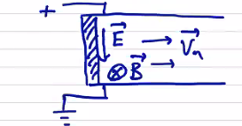

# Boundary Conditions

Mathematically, a well-posed problem requires both governing equations and a complete set of boundary conditions (the Cauchy data for the problem). The most common boundary conditions we use are perfectly conducting walls (flux surfaces) or a vacuum region.

### Perfectly Conducting Wall

For the case where the plasma extends out to a perfectly conducting (impermeable) wall. Perfectly conducting walls do not support tangential electric field:

```math
\left. \vec E_t \right|_{wall} = 0 \quad \rightarrow \quad \left. \vu n \cross \vec E \right| _{wall} = 0
```

Applying Faraday's law at the wall,

```math
\left. \vu n \cdot \pdv{\vec B}{t} \right|_{wall} = \left. - \vu n \cdot \curl \vec E \right|_{wall} = \left. \div (\vu n \cross \vec E) \right| _{wall} = 0
```
```math
\pdv{}{t} \vu n \cdot \vec B |_{wall} = 0
```
If initially there is no normal magnetic field, then
```math
\vu n \cdot \vec B|_{wall} = 0 \quad \text{if initially true}
```

And of course, for an impermeable wall,

```math
\vu n \cdot \vec v |_{wall} = 0
```

Is this a sufficient set of boundary conditions? Think back to the governing equations in conservation form
```math
\pdv{}{t} \vec Q + \div \vec F = 0
```
The boundary conditions come into play when defining $` \vec F `$ at the boundary. In particular, we need to know what $` \dd \vec S \cdot \vec F |_{wall} `$ is. In our governing equations, this will involve $` \vec E `$, $` \vec B `$, and $` \vec v `$.

### Insulating Boundary

As a slight modification, an insulating boundary can have a tangential electric field. Consider a simple geometry of parallel electrodes with an insulating wall between them.

<p align="center">  </p>

From Ohm's law
```math
\vec E + \vec v \cross \vec B = 0
```
so the only way an electric field tangential to the wall can exist is if $` \vu n \cdot \vec v \neq 0 `$.

For either a perfectly conducting or an insulating boundary, the other variables are arbitrary: $` \rho `$ , $` p `$, $` \vec v_t `$, $` \vec B_t `$.

### Vacuum Region

The plasma (radius $` R_p `$)  is supported by a region of vacuum out to a perfectly conducting wall at some radius $` R_w `$. We assume that there is no plasma in the vacuum region. The governing equations in vacuum are just Maxwell's equations

```math
\curl \vec B_{vac} = 0 \qquad \text{and} \qquad \div \vec B_{vac} = 0
```

At the wall, 
```math
\vu n \cross \vec E |_{wall} = 0
```
```math
\left. \vu n \cdot \pdv{\vec B}{t} \right|_{wall} = 0
```

What happens at the plasma-vacuum interface? We need to specify jump conditions and continuity conditions. Let's use square brackets to signify a jump:

```math
\left[ X \right] = \left. X \right|_{R_p + dr} - \left. X \right|_{R_p - dr}
```

The normal magnetic field has to be continuous.

```math
[\vu n \cdot \vec B]_{R_p} = 0
```

The tangential magnetic field jump is given by the surface current density at the jump

```math
\left[ \vu n \cross \vec B \right] _{R_p} = \mu_0 \vec K 
```

Integrating $` \grad_\perp (p + \frac{B^2}{2 \mu_0}) = \frac{B^2}{\mu_0} \vec \kappa `$ over a differential volume across the surface gives

```math
\left[ p + \frac{B^2}{2 \mu_0} \right] _{R_p} = 0
```

The plasma shape is determined self-consistently by the wall shape and surface current. This is a free-boundary problem. Another option is to specify the plasma shape, and then determine the required wall shape. This is a fixed-boundary problem.

The most realistic case includes externally applied magnetic fields coming from source coils, perhaps computed by Biot-Savart law. The vacuum magnetic field is then $` \vec B_{vac} = \vec B_{ext} + \vec B_{plasma} `$. The crazy coil shapes in the stellarator design come from the 3D geometry computations solving this problem.

### Conservation of Magnetic Flux ("Frozen-In" Flux)

Locally, $` \vec E + \vec v \cross \vec B = 0 `$ with Faraday's law
```math
\pdv{B}{t} = - \curl \vec E = - B \div \vec v + \vec B \cdot \grad \vec v - \vec v \cdot \grad B
```
From the continuity equation,
```math
\pdv{\rho}{t} + \vec v \cdot \grad \rho = - \rho \div \vec v
```
Combining we find that
```math
\dv{\vec B}{t} = \frac{\vec B}{\rho} \dv{\rho}{t} + \vec B \cdot \grad \vec v
```
```math
\rightarrow \dv{}{t} \left( \frac{\vec B}{\rho} \right) = \frac{\vec B}{\rho} \cdot \grad \vec v
```

This says that the field and plasma density move together. Locally, if the magnetic field increases then mass density increases, such that the ratio $` \vec B / \rho `$ remains constant. In the direction parallel to the magnetic field we have a term that involves field line twisting, which is a bit more complicated, but in the perpendicular direction
```math
\dv{}{t} \left( \frac{\vec B}{\rho} \right) _\perp = 0
```

If we consider globally the magnetic flux through a moving surface S at velocity $` \vec u `$. The magnetic flux penetrating the surface is
```math
\Psi = \int \vec B \cdot \dd \vec S
```
or
```math
\dv{\Psi}{t} = \int \dv{\vec B}{t} \cdot \vu n \dd S
```
```math
= \int \pdv{\vec B}{t}\cdot \vu n \dd S + \oint \vec B \cross \vec u \dd \vec l
```
Using Faraday's law

```math
\dv{\Psi}{t} = \int - \curl \vec E \cdot \vu n \dd S + \oint \vec B \cross \vec u \cdot \dd \vec l
```
```math
= \oint (- \vec E + \vec B \cross \vec u) \cdot \dd \vec l
```
Using the electric field from Ohm's law
```math
\dv{\Psi}{t} = \oint(\vec v - \vec u) \cross \vec B \cdot \dd \vec l
```
This tells us that if the surface moves with the plasma $` \vec u = \vec v `$ then 
```math
\dv{\Psi}{t} = 0
```
the flux through the surface is constant, and the flux is a constant of the topology. This is a direct consequence of ideal MHD. If we add even a small amount of resistivity, we dramatically alter the results in a process called "tearing" where the magnetic field "tears" and reconnects with itself.


