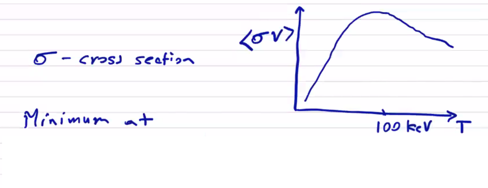
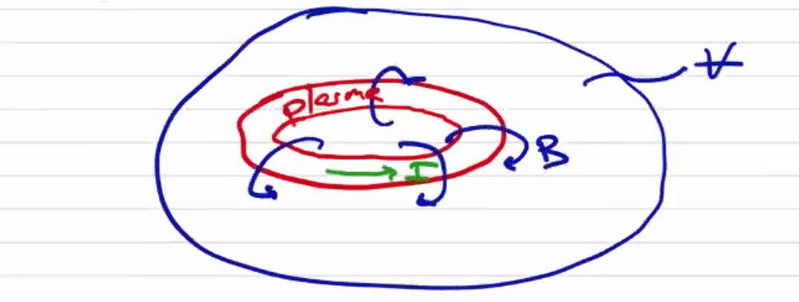

# Equilibrium for Fusion ($` \beta `$)

For a fusion device we would like to determine a magnetic configuration that confines plasma while it fuses. At fusion temperatures, the power required to maintain the equilibrium will be substantial. For a device to be useful, the power required to sustain the equilibrium must be less than the power released from fusion. Important loss terms for a confined plasma are transport (thermal conduction primarily) and radiation terms. The scaling factors are $` P_{Brem} \sim n^2 T^{1/2} `$ and $` P_{cycl} \sim n^2 T^2 `$ for radiation, and $` P_L \sim \frac{3nT}{\tau_E} `$ for thermal losses.

We know that the fusion source term will primarily come from the DT fusion reaction

```math
\text{D} + \text{T} \rightarrow \text{He}^4 (3.5\, MeV) + \text{n} (14.1\, MeV)
```

The primary fusion reaction releases an $` \alpha `$-particle and a high-energy neutron. The concept of ignition is that the neutron leaves the plasma, and the $` \alpha `$ remains to heat the plasma.

```math
P_\alpha = \frac{1}{4} n^2 \langle \sigma v \rangle E_\alpha \qquad \text{(assuming} \quad n_D = n_T = n/2 \text{)}
```


```math
P_\alpha > P_L \quad \rightarrow \quad n \tau_E > \frac{12 T}{E_\alpha \langle \sigma v \rangle}
```

To sustain fusion, we set the fusion heating term above the thermal loss term. The reaction cross-section $` \sigma `$ can be maximized to give the Lawson criterion

```math
n \tau_E > 10^{14} s / cm^3
```

<p align="center">  </p>

The Lawson criterion only applies at fusion temperatures, but it is a useful parameter even outside of ignition since it gives a ratio of fusion power to lost power

| $` T_i (keV) `$ | $` \langle \sigma v \rangle (cm^3 / s) `$ | Required $` n \tau_E (s / cm^3) `$ |
| --- | --- | ---|
| 1 | $` 7 \cdot 10^{-21} `$ | $` 5 \cdot 10^{17} `$ |
| 5 | $` 1.4 \cdot 10^{-17} `$ | $` 1.2 \cdot 10^{15} `$ |
| 20 | $` 4.3 \cdot 10^{-16} `$ | $` 1.6 \cdot 10^{14} `$ |
| 60 | $` 8.7 \cdot 10^{-16} `$ | $` 2.4 \cdot 10^{14} `$ |

We can see that the required $` n \tau_E `$ actually has a minimum around $` 20 keV `$ (at least, as far as the data in the table goes). Even though the maximum cross-section is at a much higher temperature, what we're really concerned with is the ratio of the fusion source term to the thermal loss term, which is linear in temperature.

MHD equilibrium does not place a limit on the density $` n `$. Instead, it places a limit on $` \beta `$ in order to achieve equilibrium force-balance $` (\beta = 1) `$

```math
\beta = \frac{n (T_e + T_i)}{B^2 / 2 \mu_0} \rightarrow n = \frac{ \beta B^2}{4 \mu_0 T}
```

In this form, we can more clearly see what our options are to achieve MHD equilibrium. Some devices (large-scale tokamaks) are able to achieve the requisite confinement time at a low $` \beta `$ by making use of very strong magnetic fields. Other devices are able to make use of more modest magnetic fields by working at a higher $` \beta `$.

Therefore,

```math
\tau_E > \frac{1}{\beta B^2} \frac{48 \mu_0}{E_\alpha} \frac{T^2}{\langle \sigma v \rangle}
```

The term $` \frac{T^2}{\langle \sigma v \rangle} `$ has a minimum at $` 10-20 keV `$. At 15 keV and a magnetic field of $` 5T `$ (many actual components cannot reasonably exceed such magnetic fields) then

```math
\tau_E > \frac{0.1}{\beta} \text{s}
```

For a large-scale toroidal device with $` \beta = 1\% `$, the confinement time $` \tau_E > 10s `$. If we consider a common diffusivity (how fast energy will leave due to thermal conductivity) $` D_E \approx 1 m^2 / s`$, so for a characteristic radius $` a `$ 

```math
\tau_E \approx \frac{a^2}{4 D_E} \rightarrow a > 6.3 \text{m}
```

This gives you a sense of why low-$` \beta `$ devices need to be so large. Instead, if we consider $` \beta \sim 50\% `$, $` \tau_E > 0.2 \text{s} `$ and

```math
\beta \sim 50\% \rightarrow a > 0.9 \text{m}
```

When you consider that the cost of a device (to first order) scales with the volume of the device, achieving a high $` \beta `$ is very important for fusion equilibrium. However, when we consider MHD stability we are generally forced into lower $` \beta `$ to avoid destructive instabilities. Configuration optimization is the process of balancing this trade-off.

## Virial Theorem

Application of the virial theorem to energy balance for the stress tensor $` \vec T `$ tells us that MHD equilibria must be supported by externally supplied currents.  Many times you'll hear of theoretical designs for compact toroid devices which can maintain stability under their own currents, but they are the MHD stability equivalent of a perpetual motion machine. A compact toroid cannot exist unsupported.

Writing static equilibrium:

```math
\div \left[ - \frac{ \vec B \vec B}{\mu_0} + \left( p + \frac{B^2}{2 \mu_0}\right) \vec I \right] = \div \vec T = 0
```

If we define the direction of the magnetic field to be $` \vu e _B = \vu z `$ then

```math
\vec T = p_\perp ( \vec I - \vu e_B \vu e_B ) + p_\parallel \vu e_B \vu e_B \\
= \begin{bmatrix} p_\perp & 0 & 0 \\ 0 & p_\perp & 0 \\ 0 & 0 & p_\parallel \end{bmatrix}
```
where

```math
p_\perp = p + \frac{B^2}{2 \mu_0}
```

and
```math
p_\parallel = p - \frac{B^2}{2 \mu_0}
```

A gradient vector identity gives

```math
\div (\vec r \cdot \vec T) = \vec r \cdot ( \div \vec T) + \vec T \cdot \cdot \grad \vec r
```

Integrating this expression over a volume and assuming that the volume contains a confined MHD equilibrium that is self-contained and self-supported:

<p align="center">  </p>

```math
\int_V \div ( \vec r \cdot \vec T) \dd V = \int_V (\vec r \cdot \overbrace{\cancel{(\div \vec T)}}^{\text{MHD equil.}} + \vec T \cdot \cdot \grad \vec r) \dd V
```

```math
\grad \vec r = \vec I
```

so 
```math
\vec T \cdot \cdot \grad \vec r = p_\perp + p_\perp + p_\parallel \\
= 3p + \frac{B^2}{2 \mu_0}
```

```math
\int_V (3p + \frac{B^2}{2 \mu_0} ) \dd V = \int _V \div ( \vec r \cdot \vec T) \dd V = \oint _S (\vec r \cdot \vec T) \cdot \vu n \dd S \\
= \oint _S  \left[ \vec r \cdot \vec I p_\perp + \vec r \cdot \vu e_B \vu e_B (p_\parallel - p_\perp) \right]\cdot \vu n \dd S \\
=\oint \left[ \left( \cancel{p} + \frac{B^2}{2 \mu_0} \right) \vu r \cdot \vu n - \frac{B^2}{\mu_0} (\vec r \cdot \vu e_B)(\vu e_B \cdot \vu n) \right] \dd S
```

Beyond where the plasma is contained, the pressure does not contribute $` p = 0 `$. If all current sources are contained in the configuration, the magnetic field $` \sim 1/r^3 `$ for a dipole, $` \sim 1/r^4 `$ for a quadrupole, etc. Therefore the right-hand side will fall off like

```math
RHS \propto \oint_S B^2 r \dd S \propto \left( \frac{1}{r^3} \right) ^2 r r^2 \propto \frac{1}{r^3} \text{(dipole)}
```
so $` RHS \rightarrow 0 `$ as $` r \rightarrow \infty `$. But what about the left-hand side? Both of the terms in the volume integral are positive definite, so the LHS must be positive finite and the equality can't possibly hold. The assumption that the plasma is self-contained must be invalid. This tells us that we must have external currents. 
