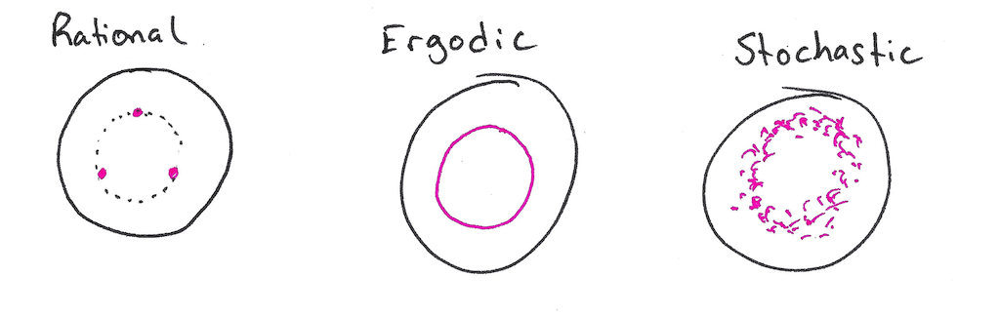
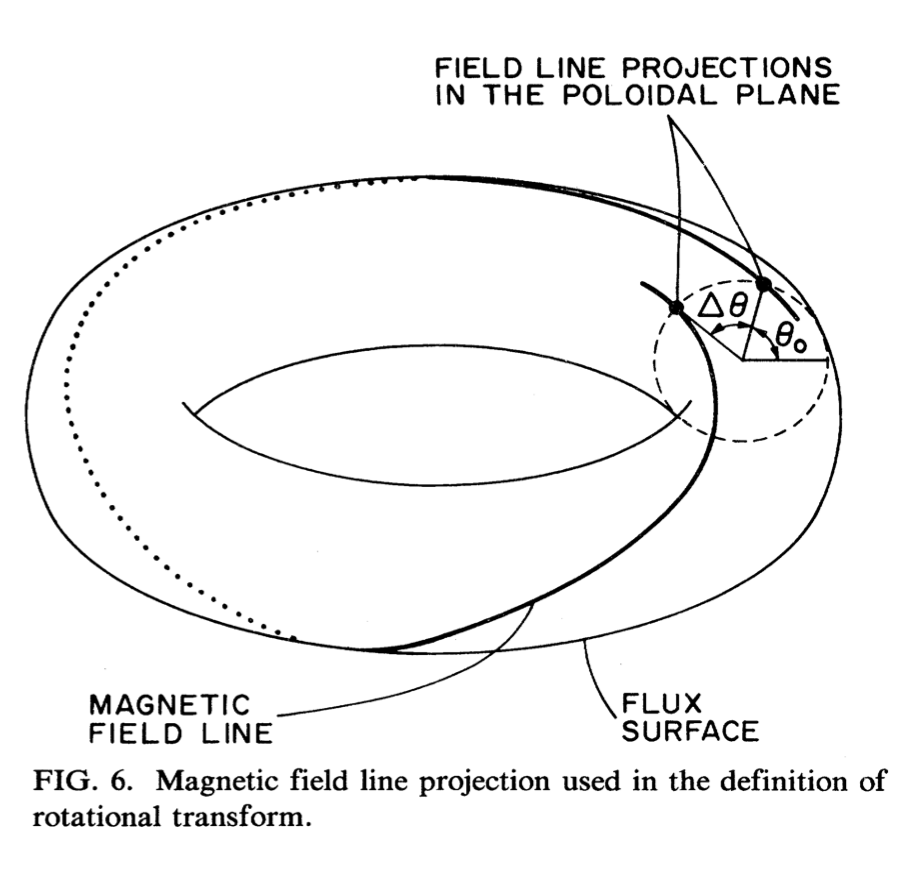
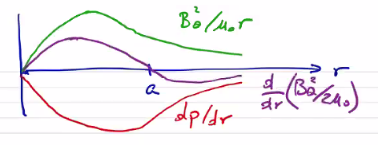

# Equilibrium for Fusion ($` \beta `$)

For a fusion device we would like to determine a magnetic configuration that confines plasma while it fuses. At fusion temperatures, the power required to maintain the equilibrium will be substantial. For a device to be useful, the power required to sustain the equilibrium must be less than the power released from fusion. Important loss terms for a confined plasma are transport (thermal conduction primarily) and radiation terms. The scaling factors are $` P_{Brem} \sim n^2 T^{1/2} `$ and $` P_{cycl} \sim n^2 T^2 `$ for radiation, and $` P_L \sim \frac{3nT}{\tau_E} `$ for thermal losses.

We know that the fusion source term will primarily come from the DT fusion reaction

```math
\text{D} + \text{T} \rightarrow \text{He}^4 (3.5\, MeV) + \text{n} (14.1\, MeV)
```

The primary fusion reaction releases an $` \alpha `$-particle and a high-energy neutron. The concept of ignition is that the neutron leaves the plasma, and the $` \alpha `$ (with energy $` E_\alpha = 3.5 MeV) `$ remains to heat the plasma.

```math
P_\alpha = \frac{1}{4} n^2 \langle \sigma v \rangle E_\alpha \qquad \text{(assuming} \quad n_D = n_T = n/2 \text{)}
```


```math
P_\alpha > P_L \quad \rightarrow \quad n \tau_E > \frac{12 T}{E_\alpha \langle \sigma v \rangle}
```

To sustain fusion, we set the fusion heating term above the thermal loss term. The reaction cross-section $` \sigma `$ can be maximized to give the Lawson criterion

```math
n \tau_E > 10^{14} s / cm^3
```

The Lawson criterion only applies at fusion temperatures, but it is a useful parameter even outside of ignition since it gives a ratio of fusion power to lost power

| $` T_i (keV) `$ | $` \langle \sigma v \rangle (cm^3 / s) `$ | Required $` n \tau_E (s / cm^3) `$ |
| --- | --- | ---|
| 1 | $` 7 \cdot 10^{-21} `$ | $` 5 \cdot 10^{17} `$ |
| 5 | $` 1.4 \cdot 10^{-17} `$ | $` 1.2 \cdot 10^{15} `$ |
| 20 | $` 4.3 \cdot 10^{-16} `$ | $` 1.6 \cdot 10^{14} `$ |
| 60 | $` 8.7 \cdot 10^{-16} `$ | $` 2.4 \cdot 10^{14} `$ |

We can see that the required $` n \tau_E `$ actually has a minimum around $` 20 keV `$ (at least, as far as the data in the table goes). Even though the maximum cross-section is at a much higher temperature, what we're really concerned with is the ratio of the fusion source term to the thermal loss term, which is linear in temperature.

MHD equilibrium does not place a limit on the density $` n `$. Instead, it places a limit on $` \beta `$ in order to achieve equilibrium force-balance $` (\beta = 1) `$

```math
\beta = \frac{n (T_e + T_i)}{B^2 / 2 \mu_0} \rightarrow n = \frac{ \beta B^2}{4 \mu_0 T}
```

In this form, we can more clearly see what our options are to achieve MHD equilibrium. Some devices (large-scale tokamaks) are able to achieve the requisite confinement time at a low $` \beta `$ by making use of very strong magnetic fields. Other devices are able to make use of more modest magnetic fields by working at a higher $` \beta `$.

Therefore,

```math
\tau_E > \frac{1}{\beta B^2} \frac{48 \mu_0}{E_\alpha} \frac{T^2}{\langle \sigma v \rangle}
```

The term $` \frac{T^2}{\langle \sigma v \rangle} `$ has a minimum at $` 10-20 keV `$. At 15 keV and a magnetic field of $` 5T `$ (many actual components cannot reasonably exceed such magnetic fields) then

```math
\tau_E > \frac{0.1}{\beta} \text{s}
```

For a large-scale toroidal device with $` \beta = 1\% `$, the confinement time $` \tau_E > 10s `$. If we consider a common diffusivity (how fast energy will leave due to thermal conductivity) $` D_E \approx 1 m^2 / s`$, so for a characteristic radius $` a `$ 

```math
\tau_E \approx \frac{a^2}{4 D_E} \rightarrow a > 6.3 \text{m}
```

This gives you a sense of why low-$` \beta `$ devices need to be so large. Instead, if we consider $` \beta \sim 50\% `$, $` \tau_E > 0.2 \text{s} `$ and

```math
\beta \sim 50\% \rightarrow a > 0.9 \text{m}
```

When you consider that the cost of a device (to first order) scales with the volume of the device, achieving a high $` \beta `$ is very important for fusion equilibrium. However, when we consider MHD stability we are generally forced into lower $` \beta `$ to avoid destructive instabilities. Configuration optimization is the process of balancing this trade-off.

## Virial Theorem

Application of the virial theorem to energy balance for the stress tensor $` \vec T `$ tells us that MHD equilibria must be supported by externally supplied currents.  Many times you'll hear of theoretical designs for compact toroid devices which can maintain stability under their own currents, but they are the MHD stability equivalent of a perpetual motion machine. A compact toroid cannot exist unsupported.

Writing static equilibrium:

```math
\div \left[ - \frac{ \vec B \vec B}{\mu_0} + \left( p + \frac{B^2}{2 \mu_0}\right) \vec I \right] = \div \vec T = 0
```

If we define the direction of the magnetic field to be $` \vu e _B = \vu z `$ then

```math
\vec T = p_\perp ( \vec I - \vu e_B \vu e_B ) + p_\parallel \vu e_B \vu e_B \\
= \begin{bmatrix} p_\perp & 0 & 0 \\ 0 & p_\perp & 0 \\ 0 & 0 & p_\parallel \end{bmatrix}
```
where

```math
p_\perp = p + \frac{B^2}{2 \mu_0}
```

and
```math
p_\parallel = p - \frac{B^2}{2 \mu_0}
```

A gradient vector identity gives

```math
\div (\vec r \cdot \vec T) = \vec r \cdot ( \div \vec T) + \vec T \cdot \cdot \grad \vec r
```

Integrating this expression over a volume and assuming that the volume contains a confined MHD equilibrium that is self-contained and self-supported:

<p align="center">  </p>

```math
\int_V \div ( \vec r \cdot \vec T) \dd V = \int_V (\vec r \cdot \overbrace{\cancel{(\div \vec T)}}^{\text{MHD equil.}} + \vec T \cdot \cdot \grad \vec r) \dd V
```

```math
\grad \vec r = \vec I
```

so 
```math
\vec T \cdot \cdot \grad \vec r = p_\perp + p_\perp + p_\parallel \\
= 3p + \frac{B^2}{2 \mu_0}
```

```math
\int_V (3p + \frac{B^2}{2 \mu_0} ) \dd V = \int _V \div ( \vec r \cdot \vec T) \dd V = \oint _S (\vec r \cdot \vec T) \cdot \vu n \dd S \\
= \oint _S  \left[ \vec r \cdot \vec I p_\perp + \vec r \cdot \vu e_B \vu e_B (p_\parallel - p_\perp) \right]\cdot \vu n \dd S \\
=\oint \left[ \left( \cancel{p} + \frac{B^2}{2 \mu_0} \right) \vu r \cdot \vu n - \frac{B^2}{\mu_0} (\vec r \cdot \vu e_B)(\vu e_B \cdot \vu n) \right] \dd S
```

Beyond where the plasma is contained, the pressure does not contribute $` p = 0 `$. If all current sources are contained in the configuration, the magnetic field $` \sim 1/r^3 `$ for a dipole, $` \sim 1/r^4 `$ for a quadrupole, etc. Therefore the right-hand side will fall off like

```math
RHS \propto \oint_S B^2 r \dd S \propto \left( \frac{1}{r^3} \right) ^2 r r^2 \propto \frac{1}{r^3} \text{(dipole)}
```
so $` RHS \rightarrow 0 `$ as $` r \rightarrow \infty `$. But what about the left-hand side? Both of the terms in the volume integral are positive definite, so the LHS must be positive finite and the equality can't possibly hold. The assumption that the plasma is self-contained must be invalid. This tells us that we must have external currents. 

## Magnetic Flux Surfaces

The vast difference in thermal conductivity parallel and perpendicular to the magnetic field in a plasma confinement configuration leads to an avoidance of any open field lines. Magnetic equilibria are generally toroidal to eliminate end losses from open configurations. In general fusion confinement devices, magnetic field lines lie on a set of closed nested toroidal surfaces. This means that we can no longer describe any equilibria in a solely 1D geometry. The minor radius is no longer the only important scale length.

From $` \vec j \cross \vec B = \grad p `$, we know that the pressure gradient is perpendicular to $` \vec j `$ and $` \vec B `$, and therefore both $` \vec B `$ and $` \vec j `$ lie on surfaces of uniform pressure. We call these toroidal surfaces either magnetic surfaces or **flux surfaces**. We can use these surfaces to build a 1-dimensional description.

<p align="center">  </p>

As a brief aside, some geometrical vocabulary will be useful when describing toroidal geometry. A toroid is any surface of revolution with a hole in the middle. A torus is the particular case of a toroid in which the revolved figure is a circle.

We will define our global toroidal coordinate system to consist of the major axis $` (z) `$, the distance from the major axis $` (R) `$, and the azimuthal angle around the major axis $` (\phi) `$.

<p align="center">  </p>

We will also make use of a poloidal coordinate system measured by minor radius (distance from the minor axis) $` r `$ and the poloidal angle from the minor axis $` \theta `$. We will generally refer to a point on the torus relative to the major axis $` (R, z, \phi) `$, or relative to the minor axis $` (r, \theta, \phi) `$, or in spherical coordinates $` (R, \theta, \phi) `$. The major radius $` R_0 `$ is the distance from the major axis to the minor axis. The minor radius $` a `$ is the characteristic distance from the minor axis to the exterior of the revolved figure. Usually we will find symmetry under $` \phi `$.

The aspect ratio of a torus is the ratio of the major radius to the minor radius.

```math
A = \frac{R_0}{a}
```

When we talk about a "toroidal surface," we mean a cross-section of the toroidal rotation. When we talk about a "poloidal surface" we mean a surface which is coplanar with the minor axis:

<p align="center">  </p>

The poloidal flux is determined by the size of the poloidal surface and the poloidal magnetic field:

```math
\Psi _p = \int_{S_p} \vec B \cdot \dd \vec S
```

and the toroidal flux is determined by the size of a toroidal surface and the toroidal magnetic field:

```math
\Psi_t = \int_{S_t} \vec B \cdot \dd \vec S
```

Considering the poloidal flux, we can see that if we expand the size of the surface towards the minor radius, the flux will increase until eventually we come to a point where the flux begins to decrease. The position of this maximum is called the **magnetic axis**, which does not necessarily correspond to the minor axis. In fact, it is generally displaced from the minor axis.

<p align="center">  </p>

To refer back to something more familiar, we'll define the same terms for a cylindrical geometry $`(r, \theta, z)  `$. An axial surface corresponds with a toroidal surface, and an azimuthal surface corresponds with a poloidal surface:

<p align="center">  </p>

If we consider the trajectory of a single field line, what sorts of surfaces will it trace out? What surface will contain the field line? As it turns out, there are three options:

1. Rational surface - the field line closes on itself, and it does so after a finite number of revolutions. One way to quickly visualize such a surface is to draw a Poincaré puncture plot. Choose a toroidal plane and plot a point wherever the field line punctures the surface. A Poincaré puncture plot of a rational surface contains a finite number of points and no continuous curves.
2. Ergodic surface - the field line completely covers an entire surface, which is to say the field line punctures any toroidal surface an infinite number of times. In other words, it never closes on itself and defines an irrational curve.
3. Stochastic region - In this case, there is no definite surface and the field line fills a volume.

<p align="center">  </p>

Generally rational surfaces and ergodic surfaces are largely equivalent, but by introducing a small amount of resistivity a rational surface can lead to magnetic islands. One can imagine the addition of resistivity equivalent to allowing a small degree of motion of the magnetic field lines. In an ergodic surface, a flux surface is defined by a single (irrational) field line. If it moves toward itself in one location it will necessarily move away from itself in another location. But in a rational surface, different field lines can lie on the same constant pressure surface and will tend to move towards each other. By concentrating into magnetic islands, the flux surfaces are now more closely spaced, and the pressure gradient increases (a bad thing!)

<p align="center">  </p>

<!-- <p align="center">  </p> -->

**Surface quantities**: Since pressure, current (not current density!), and _flux_ (not field!) are constant along a flux surface, it is convenient to use flux $` \Psi_p `$ as a coordinate. A particular poloidal flux itself uniquely determines a poloidal surface with constant pressure and current. The flux surface quantities are $` p, \, \Psi_p, \, \Psi_t, \, I_p = \int_{S_p} \vec j \cdot \dd \vec S, \, I_t = \int_{S_t} \vec j \cdot \dd \vec S`$.

Surface quantities are not independent. The poloidal current $` I_p `$ affects the toroidal field $` B_t `$ and toroidal flux $` \Psi_t `$. The toroidal current affects the poloidal field $` B_p `$ and poloidal flux $` \Psi_p `$.

```math
B_t = \vec B \cdot \vu \phi
```

```math
\vec B_p = B_\theta \vu \theta + B_z \vu z \\
= B_r \vu R + B_z \vu z
```

## Toroidal Force Balance


Toroidal equilibria solves the end losses of linear equilibrium, but generates a new force which must be balanced. This is a result of the virial theorem.

### Poloidal Fields (Tire Tube Pressure Force)

If you think of a flexible bike tire being inflated, as the pressure within the inner tube increases, the major radius will increase! Why is this? The pressure within the tire is isotropic. As we pump up the tire, the pressure increase causes a force imbalance with the atmospheric pressure that causes the tube to expand. To simplify, we can consider a square tube with inner "radius" $` a `$. The radial force scales with the pressure over the outer and inner surfaces

```math
F_r = p S_{outer} - p S_{inner} \\
\sim p (R_0 + a) a - p (R_0 - a) a \sim 2 a^2 p
```

!!! error "Missing content here on how to balance radial forces for purely poloidal fields (axisymmetric) with a conducting wall"


Alternatively, we can use vertical external field coils to increase the field strength near the outer wall. They will also tend to center the plasma between the coils, so they have the advantage of preventing the plasma from drifting upwards or downwards

<p align="center">  </p>

### Toroidal Fields

Now let's consider driving a toroidal field in the plasma using a central coil on the major axis. Driving a toroidal field $` B_\phi `$ will also create a poloidal current $` j_\theta `$. We know that the driven field will decay as $` 1/R `$ through the plasma. In actuality, the relationship is not perfectly $` 1/R `$ because of the generated poloidal current, which will modify the field within the plasma. Depending on the orientation of $` j_\theta `$, it could either increase or decrease the poloidal field within the plasma. These are two different operations by which the plasma interacts with the magnetic field. When the induced plasma current tends to increase the field, we have a paramagnetic effect. In the opposite case (decrease) there is a diamagnetic effect. Generally, plasmas are diamagnetic, but there are certain situations where they become paramagnetic.

<p align="center">  </p>

Here again, we have a larger field on the in-bore side than on the out-bore side, so there will be a force imbalance tending to push the plasma towards larger radii. We might consider surrounding the plasma with a conducting wall, as we did previously, but we run into a difficulty determining a current distribution in the wall which would balance the radial effect. Any current distribution must be circular; because of the geometry of a torus such a current distribution would have the same force contribution on both the inside and outside edges. There is no way to stabilize the distribution with purely toroidal fields.


# 1-Dimensional Equilibria

## $` \theta `$-pinch

In a $` \theta `$ pinch, we have an applied axial field generated by a driven azimuthal current distribution. The way these usually work is that you begin with a plasma generated by some pre-ionization process and zero field. Then you crank up the current to drive an azimuthal current in the plasma (in the opposite direction as the external current).

```math
\vec j \cross \vec B = \grad p \quad \rightarrow \quad j_\theta B_z = \dv{p}{r}
```

```math
j_\theta = - \frac{1}{\mu_0} \dv{B_z}{r}
```

```math
\dv{p}{r} = - \frac{1}{\mu_0} B_z \dv{B_z}{r} = - \dv{}{r} \left( \frac{B_z ^2}{2 \mu_0} \right)
```
```math
p + \frac{B_z ^2}{2 \mu_0} = \text{constant} = \frac{B_0 ^2}{2 \mu_0}
```

<p align="center">  </p>

At equilibrium, the magnetic pressure balances the plasma pressure. If we say that the pressure is

```math
p = p_0 e^{- r^2 / a^2}
```

with $` p_0 `$ the pressure on-axis, then we can solve for the axial field

```math
B_z = B_0 (1 - B_0 e^{-r^2/a^2})^{1/2}
```

We can define the peak $` \beta `$ to be the ratio of the on-axis pressure to the maximum magnetic field

```math
\beta_0 = \frac{p_0}{B_0 ^2 / 2 \mu_0}
```

By definition, the peak $` \beta `$  will always be $` \leq  1 `$. We can define $` \langle \beta \rangle `$ 

```math
\langle \beta \rangle = \frac{ \langle p \rangle }{B_a ^2 / 2 \mu_0}
```

where $` B_a `$ is a characteristic field value, typically taken to be at the plasma edge.

```math
\langle \beta \rangle = \frac{2 \mu_0}{B_0 ^2 \pi a^2} \int _0 ^a 2 \pi r p \, \dd r
```
```math
= \frac{2}{a^2} \int_0 ^a \frac{ rp}{B_0 ^2/2 \mu_0} \dd r = \frac{2}{a^2} \int_0 ^a \left( 1 - \frac{B_z ^2}{B_0 ^2} \right) r \dd r
```

In this form, we can see that because $` B_z `$ will everywhere be less than $` B_0 `$, we can increase $` \langle \beta \rangle `$ by driving $` B_z `$ as low as possible. In this particular example, $` \langle \beta \rangle / \beta_0 = 63\% `$. 

## Z-pinch

In the case of a Z-pinch, we only have an applied axial current.

```math
\vec j = j_z (r) \vu z
```

For force balance

```math
\vec j \cross \vec B = \grad p \quad \rightarrow \quad - j_z B_\theta = \dv{p}{r}
```
```math
j_z = \frac{1}{\mu_0} \frac{1}{r} \dv{}{r} ( r B_\theta) 
```

```math
- \dv{p}{r} = \frac{B_\theta}{\mu_0 r} \dv{}{r} ( r B_\theta)
```

If we find it convenient we can separate this into a magnetic pressure term

```math
- \dv{}{r} \left( p + \frac{B_\theta ^2}{2 \mu_0} \right) = \frac{B_\theta ^2}{\mu_0 r}
```

### Bennett Profile

An example of an achievable distribution is the Bennett profile, which has a diffuse form

```math
B_\theta = \frac{\mu_0 I}{2 \pi} \frac{r}{r^2 + a^2}
```
```math
j_z = \frac{I}{\pi} \frac{a^2}{(r^2 + a^2) ^2}
```

```math
p = \frac{\mu_0 I^2}{8 \pi ^2} \frac{a^2}{(r^2 + a^2)^2}
```

Interestingly, $` j \propto p `$. For a uniform temperature, $` j \propto n `$. Since current density is the product of $` \vec v `$ and $` n `$, this says that we have a uniform drift velocity and all particles are drifting with the same velocity at all points along the profile. If we consider what the equilibrium profile looks like for a Bennett profile:

<p align="center">  </p>

So for $` r < a `$ we have magnetic tension and pressure which balance the plasma pressure. For $` r \geq a `$ we have magnetic tension which balances both plasma pressure and magnetic pressure.

The Z-pinch $` \langle \beta \rangle `$ 

```math
\langle \beta \rangle \equiv \frac{ \langle p \rangle}{B_a ^2 / 2 \mu_0} \\
= \frac{2 \mu_0}{B_a ^2 \pi a^2} \int_0 ^a 2 \pi r p \dd r
```

If we multiply the force balance by $` r^2 `$ and integrate

```math
\int_0 ^a r^2 \dv{p}{r} \dd r + \frac{1}{\mu_0} \int_0 ^a r B_\theta \dv{}{r} (r B_\theta) \dd r = 0 \\
0 = \left[ r^2 p \right] _0 ^a - \int_0 ^a p \dd (r^2) + \left[ \frac{(r B_\theta)^2}{2 \mu_0} \right] _0 ^a
```

If we have a discrete pinch such that $` p(a) = 0 `$ then the first term vanishes.

```math
\int_0 ^a 2 r p \dd r = \frac{(a B_a)^2}{2 \mu_0}
```

If we substitute our definition of $` \langle \beta \rangle `$, we find $` \langle \beta \rangle = 1 `$. For a diffuse pinch in which $` p(a) \neq 0 `$ we end up with $` \langle \beta \rangle \leq 1 `$ and we have a wall-supported plasma. Ideal confinement ($` \langle \beta \rangle = 1 `$) is a very nice property and is what makes the Z-pinch configuration so interesting.

## Stability Considerations

Instability results if there exists a plasma displacement that leads to a lower energy state. There are several ways to provide stability in the context of MHD. The two most common are **magnetic shear** and **magnetic well**.

### Magnetic Shear

In ideal MHD, magnetic field lines can not break or tear. Let's consider some flux surface containing field lines $` \vec B_3 `$. Behind it, we have another flux surface containing field lines $` B_2 `$ which are not parallel to $` \vec B_3 `$, and the same for $` \vec B_1 `$.

<p align="center">  </p>

Because the field lines are a different angles to each other, these flux surfaces can _not_ interpenetrate. In other words, if the flux surface pressures are $` P_1 > P_2 > P_3 `$, we can maintain the pressure gradient and prevent the flux surfaces from moving each other. What prevents the surfaces from achieving a lower energy state is the magnetic shear between flux surfaces.

Without shear, the surfaces can interpenetrate and exchange positions. In the case of a toroidal geometry, magnetic shear is defined by the rotational transform $` \iota `$, or by the safety factor

```math
q = \frac{2 \pi}{\iota} 
```

Generally speaking, $` q `$ is generally referenced for tokamaks and $` \iota `$ is referenced for stellarators.

