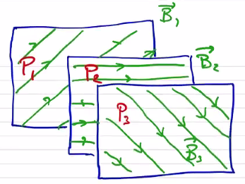
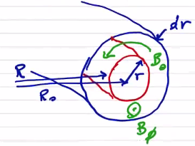
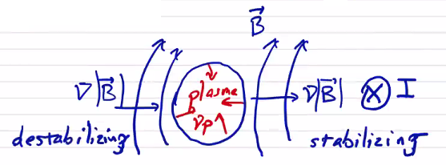
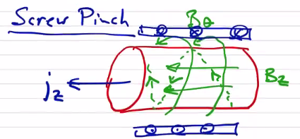

# 1-Dimensional Equilibria

## The $` \theta `$-pinch

In a $` \theta `$ pinch, we have an applied axial field generated by a driven azimuthal current distribution. The way these usually work is that you begin with a plasma generated by some pre-ionization process and zero field. Then you crank up the current to drive an azimuthal current in the plasma (in the opposite direction as the external current).

```math
\vec j \cross \vec B = \grad p \quad \rightarrow \quad j_\theta B_z = \dv{p}{r}
```

```math
j_\theta = - \frac{1}{\mu_0} \dv{B_z}{r}
```

```math
\dv{p}{r} = - \frac{1}{\mu_0} B_z \dv{B_z}{r} = - \dv{}{r} \left( \frac{B_z ^2}{2 \mu_0} \right)
```
```math
p + \frac{B_z ^2}{2 \mu_0} = \text{constant} = \frac{B_0 ^2}{2 \mu_0}
```

<p align="center">  </p>

At equilibrium, the magnetic pressure balances the plasma pressure. If we say that the pressure is

```math
p = p_0 e^{- r^2 / a^2}
```

with $` p_0 `$ the pressure on-axis, then we can solve for the axial field

```math
B_z = B_0 (1 - B_0 e^{-r^2/a^2})^{1/2}
```

We can define the peak $` \beta `$ to be the ratio of the on-axis pressure to the maximum magnetic field

```math
\beta_0 = \frac{p_0}{B_0 ^2 / 2 \mu_0}
```

By definition, the peak $` \beta `$  will always be $` \leq  1 `$. We can define $` \langle \beta \rangle `$ 

```math
\langle \beta \rangle = \frac{ \langle p \rangle }{B_a ^2 / 2 \mu_0}
```

where $` B_a `$ is a characteristic field value, typically taken to be at the plasma edge.

```math
\langle \beta \rangle = \frac{2 \mu_0}{B_0 ^2 \pi a^2} \int _0 ^a 2 \pi r p \, \dd r
```
```math
= \frac{2}{a^2} \int_0 ^a \frac{ rp}{B_0 ^2/2 \mu_0} \dd r = \frac{2}{a^2} \int_0 ^a \left( 1 - \frac{B_z ^2}{B_0 ^2} \right) r \dd r
```

In this form, we can see that because $` B_z `$ will everywhere be less than $` B_0 `$, we can increase $` \langle \beta \rangle `$ by driving $` B_z `$ as low as possible. In this particular example, $` \langle \beta \rangle / \beta_0 = 63\% `$. 

## Z-pinch

In the case of a Z-pinch, we only have an applied axial current.

```math
\vec j = j_z (r) \vu z
```

For force balance

```math
\vec j \cross \vec B = \grad p \quad \rightarrow \quad - j_z B_\theta = \dv{p}{r}
```
```math
j_z = \frac{1}{\mu_0} \frac{1}{r} \dv{}{r} ( r B_\theta) 
```

```math
- \dv{p}{r} = \frac{B_\theta}{\mu_0 r} \dv{}{r} ( r B_\theta)
```

If we find it convenient we can separate this into a magnetic pressure term

```math
- \dv{}{r} \left( p + \frac{B_\theta ^2}{2 \mu_0} \right) = \frac{B_\theta ^2}{\mu_0 r}
```

### Bennett Profile

An example of an achievable distribution is the Bennett profile, which has a diffuse form

```math
B_\theta = \frac{\mu_0 I}{2 \pi} \frac{r}{r^2 + a^2}
```
```math
j_z = \frac{I}{\pi} \frac{a^2}{(r^2 + a^2) ^2}
```

```math
p = \frac{\mu_0 I^2}{8 \pi ^2} \frac{a^2}{(r^2 + a^2)^2}
```

Interestingly, $` j \propto p `$. For a uniform temperature, $` j \propto n `$. Since current density is the product of $` \vec v `$ and $` n `$, this says that we have a uniform drift velocity and all particles are drifting with the same velocity at all points along the profile. If we consider what the equilibrium profile looks like for a Bennett profile:

<p align="center">  </p>

So for $` r < a `$ we have magnetic tension and pressure which balance the plasma pressure. For $` r \geq a `$ we have magnetic tension which balances both plasma pressure and magnetic pressure.

The Z-pinch $` \langle \beta \rangle `$ 

```math
\langle \beta \rangle \equiv \frac{ \langle p \rangle}{B_a ^2 / 2 \mu_0} \\
= \frac{2 \mu_0}{B_a ^2 \pi a^2} \int_0 ^a 2 \pi r p \dd r
```

If we multiply the force balance by $` r^2 `$ and integrate

```math
\int_0 ^a r^2 \dv{p}{r} \dd r + \frac{1}{\mu_0} \int_0 ^a r B_\theta \dv{}{r} (r B_\theta) \dd r = 0 \\
0 = \left[ r^2 p \right] _0 ^a - \int_0 ^a p \dd (r^2) + \left[ \frac{(r B_\theta)^2}{2 \mu_0} \right] _0 ^a
```

If we have a discrete pinch such that $` p(a) = 0 `$ then the first term vanishes.

```math
\int_0 ^a 2 r p \dd r = \frac{(a B_a)^2}{2 \mu_0}
```

If we substitute our definition of $` \langle \beta \rangle `$, we find $` \langle \beta \rangle = 1 `$. For a diffuse pinch in which $` p(a) \neq 0 `$ we end up with $` \langle \beta \rangle \leq 1 `$ and we have a wall-supported plasma. Ideal confinement ($` \langle \beta \rangle = 1 `$) is a very nice property and is what makes the Z-pinch configuration so interesting.


## Stability Considerations

Instability results if there exists a plasma displacement that leads to a lower energy state. There are several ways to provide stability in the context of MHD. The two most common are **magnetic shear** and **magnetic well**.

### Magnetic Shear

In ideal MHD, magnetic field lines can not break or tear. Let's consider some flux surface containing field lines $` \vec B_3 `$. Behind it, we have another flux surface containing field lines $` B_2 `$ which are not parallel to $` \vec B_3 `$, and the same for $` \vec B_1 `$.

<p align="center">  </p>

Because the field lines are a different angles to each other, these flux surfaces can _not_ interpenetrate. In other words, if the flux surface pressures are $` P_1 > P_2 > P_3 `$, we can maintain the pressure gradient and prevent the flux surfaces from moving each other. What prevents the surfaces from achieving a lower energy state is the magnetic shear between flux surfaces.

Without shear, the surfaces can interpenetrate and exchange positions. In the case of a toroidal geometry, magnetic shear is defined by the rotational transform $` \iota `$, or by the safety factor

```math
q = \frac{2 \pi}{\iota} 
```

Generally speaking, $` q `$ is generally referenced for tokamaks and $` \iota `$ is referenced for stellarators. Another way of picturing the safety factor in a toroidal geometry is

```math
q \equiv \frac{\text{no. of windings long way}}{\text{no. of windings short way}} \\
= \frac{ \dv{\psi_t}{V}}{\dv{\phi_p}{V}} = \dv{\phi_t}{\phi_p} \\
= \frac{n}{m} = \frac{\text{toroidal transits}}{\text{poloidal transits}}
```

In a cylindrical (1D) geometry it is just

```math
q = \frac{\text{longitudinal transits}}{\text{azimuthal transits}}
```

Let's calculate the safety factor for a toroidal geometry:

<p align="center">  </p>

```math
\dv{\phi_p}{V} = \frac{ B_\theta 2 \pi R \dd r}{2 \pi R_0 2 \pi r \dd r} \\
= \frac{ B_\theta}{2 \pi r} \frac{R}{R_0}
```

```math
\dv{\phi_t}{V} = \frac{B_\phi 2 \pi r \dd r}{2 \pi R_0  2 \pi r \dd r} \\
= \frac{B_\phi}{2 \pi R_0}
```

```math
q = \frac{r B_\phi}{R B_\theta}
```

In a cylindrical geometry the analysis is even simpler

```math
q = 2 \pi \frac{r B_z}{L B_\theta}
```

As a note, it would appear that $` q \rightarrow 0 `$ at the magnetic axis as $` r \rightarrow 0 `$, but in general $` B_\theta \rightarrow 0 `$ as well, and the safety factor is generally bounded at $` r \rightarrow 0 `$

$` q `$ is a flux surface quantity.

We care about magnetic shear. How does that relate to the safety factor? Magnetic shear is defined as

```math
s \equiv 2 \frac{\dd q / q}{\dd V /V} = 2 \dv{\ln (q)}{\ln(V)}
```

Even a uniform $` B_z `$ or $` B_\theta `$ produces a finite magnetic shear because of the way that $` r `$ and $` B_\theta `$ change. The safety factor is often considered synonymous with magnetic shear, and often we don't even compute $` s `$.

Shear is generally a stabilizing effect. Interchange between flux surfaces can be prevented/inhibited by shear, or by making it energetically unfavorable. Shear tends to stabilize current-driven instabilities.

### Magnetic Well

As before, we can consider two adjacent flux surfaces $` B_1, P_1 `$ and $` B_2, P_2 `$. If $` B_2 > B_1 `$ and $` P_2 > P_1 `$, the interchange is energetically favorable. But if $` B_2 > B_1 `$ and $` P_2 < P_1 `$ then the interchange may be unfavorable without any magnetic shear.

Consider a plasma confined by an externally applied magnetic field generated by a coil $` I `$ 

<p align="center">  </p>

On the left side, the magnetic field gradient is in the same direction as the plasma pressure gradient, which is a destabilizing configuration. Flux surfaces are able to interchange easily, and the magnetic field is described as having bad curvature. On the right side, the gradients are in the same direction and the magnetic field has a good curvature.

We can define the "wellness" $` W `$ as

```math
W \equiv \frac{ \text{total pressure change relative to mag. pressure}}{\text{relative volume change}} \\
= \frac{\dd \langle p + B^2/2 \mu_0 \rangle / \langle B^2/2 \mu_0 \rangle}{\dd V / V}
```
where the angle brackets indicate a quantity integrated along a field line
```math
\langle Q \rangle \equiv \frac{\int_0 ^L \frac{ Q \dd l}{|B|}}{\int_0 ^l \frac{\dd l}{|B|}}
```

For a stabilizing effect, the wellness must be greater than 0. This means that the magnetic pressure must increase faster than the pressure decreases to prevent pressure-driven instabilities.

Since $` W `$ is evaluated along a field line, it is also a surface quantity.

### Application to 1D Equilibria

$` \theta `$-pinch: Since $` B_\theta = 0 `$, $` q \rightarrow \infty `$, which really just means $` q `$ is not well defined for a $` \theta `$-pinch. If we consider some small $` \delta B_\theta `$, we get a very large $` q `$. From a magnetic shear perspective, a $` \theta `$-pinch has very large values of shear and very good stability properties.

The wellness is

```math
W = \frac{V}{\langle B^2 \rangle} \dv{}{V} \langle 2 \mu_0 p + B^2 \rangle \\
 = \frac{\pi r^2 L}{B_z ^2} \frac{1}{2 \pi r L} \dv{}{r} (2 \mu_0 p + B_z ^2) \\
 = \frac{\mu_0 r}{B_z ^2} \dv{}{r} \left( p + \frac{B_z ^2}{2 \mu_0} \right) = 0 
```
so a $` \theta `$-pinch has neutral magnetic well.

Vacuum case:

```math
W = \frac{\mu_0 r}{ B_z ^2} \dv{}{r} \left( \frac{ B_z ^2}{2 \mu_0} \right) = 0
```
So vacuum magnetic fields also have neutral wellness. This leads to a general result sometimes referred to as "a plasma cannot dig its own well." In other words, by introducing plasma to a magnetic configuration, it cannot make the configuration more stable than it was. Plasmas make stability more challenging, not less.

Z-pinch:

Since $` B_z = 0 `$, $` q = 0 `$ and there is no magnetic shear. Even for a small value of $` \delta B_z `$ you still get a small $` q `$. The magnetic well properties of a Z-pinch are

```math
W = \frac{V}{\langle B^2 \rangle} \dv{}{V} \langle 2 \mu_0 p + B^2 \rangle \\
= \frac{\mu_0 r}{B_\theta ^2} \dv{}{r} \left( p + \frac{B_\theta ^2}{2 \mu_0} \right) \\
= \frac{\mu_0 r}{B_\theta ^2} \left( - \frac{ B_\theta ^2}{ \mu_0 r} \right) = -1
```

Recall that $` W > 0 `$ for stability, so the Z-pinch has negative magnetic well and provides no pressure stability.

In summary, 

 - Both $` \theta `$- and Z-pinch have high $` \beta `$
 - $` \theta `$-pinch is stable
 - Z-pinch is unstable
 - End losses in a $` \theta `$ pinch enormous since $` k_\parallel \gg k_\perp `$ 

## Screw Pinch

A natural extension is to combine a moderate toroidal field and a moderate poloidal field to produce a screw pinch configuration.

<p align="center">  </p>

```math
\curl \vec B = \mu_0 \vec j
```
```math
\rightarrow j_\theta = - \frac{1}{\mu_0 } \dv{B_z}{r} 
```
```math
j_z = \frac{1}{\mu_0 r} \dv{}{r} (r B_\theta)
```

For static MHD equilibrium

```math
\vec j \cross \vec B = \grad p
```
```math
\dv{}{r} \left( p + \frac{ B_\theta ^2 + B_z ^2}{2 \mu_0} \right) = - \frac{B_\theta ^2}{\mu_0 r}
```

We can define a toroidal $` \beta `$ where $` B_0 = B_z (a) `$ 
```math
\beta_t = \frac{\langle p \rangle }{B_0 ^2 / 2 \mu_0} \\
= \frac{2 \mu_0}{ B_0 ^2} \frac{1}{\pi a^2} \int _0 ^a 2 \pi r p \dd r
```

and in the poloidal direction with $` B_{\theta, a} = B_\theta (a) =  \frac{\mu_0 I}{2 \pi a}  `$ 

```math
\beta_p = \frac{\langle p \rangle}{B_{\theta, a} ^2 / 2 \mu_0} \\
= \frac{8 \pi ^2 a^2}{ \mu_0 I_0 ^2} \left( \frac{1}{\pi a^2} \int _0 ^a 2 \pi r p \dd r \right) \\
= \frac{16 \pi ^2}{\mu_0 I_0 ^2} \int_0 ^a r p \dd r
```

To proceed we can multiply the force balance by $` r^2 `$ and integrate

```math
\underbrace{\int_0 ^a r^2 \pdv{p}{r} \dd r}_{(1)} + \underbrace{\int _0 ^a \pdv{}{r} \left( \frac{ B_\theta ^2 + B_z ^2 }{2 \mu_0} \right) \dd r}_{(2)} + \underbrace{\int_0 ^a r^2 \frac{B_\theta ^2}{\mu_0 r} \dd r}_{(3)} = 0
```

```math
(1) = \int_0 ^a r^2 \dd p = \left. r^2 p \right|_0 ^a - \int_0 ^a p \dd (r^2) = - \int_0 ^a 2 r p \dd r
```

```math
(2) = \int_0 ^a r^2 \dd \left( \frac{B_\theta ^2 + B_z ^2}{2 \mu_0 } \right) \\
= \left. r^2 \left( \frac{ B_\theta ^2 + B_z ^2}{2 \mu_0 } \right) \right|_0 ^a - \int_0 ^a r \left( \frac{ B_\theta ^2 + B_z ^2}{\mu_0} \right) \dd r
```

```math
(3) = \int_0 ^a r \frac{B_\theta ^2}{\mu_0} \dd r
```

Combining we have

```math
- \int_0 ^a 2 r p \dd r + \frac{a^2 B_{\theta, a}^2}{2 \mu_0} + \overbrace{\frac{a^2 B_0 ^2}{2 \mu_0}}^{B_0 = B_z(r = a)} - \int_0 ^a r \frac{B_z ^2}{\mu_0} \dd r = 0 \\
- \int_0 ^a 2 r p \dd r + \frac{ \mu_0 I_0 ^2}{8 \pi ^2} + \int_0 ^a r \left( \frac{ B_\theta ^2 - B_z ^2}{\mu_0} \right) \dd r = 0
```

Dividing $` \int_0 ^a 2 r p \dd r `$ gives

```math
\left[ \frac{16 \pi^2}{\mu_0 I^2} \int_0 ^a r p \dd r \right] ^{-1} + \left[\frac{4 \mu_0}{B_0 ^2 a^2} \int_0 ^a r p \dd r \right] ^{-1} \frac{2}{a^2} \int_0 ^a \left(1 - \frac{B_z ^2}{B_0 ^2} \right) r \dd r = 1
```
or

```math
\frac{1}{\beta_p} + \frac{\alpha_t}{\beta_t} = 1
```
where
```math
\alpha_t = \frac{2}{a^2} \int_0 ^a \left( 1 - \frac{B_z^2}{B_0 ^2} \right) r \dd r
```
is the diamagnetism.

```math
\beta _p = \left( 1 - \frac{\alpha_t}{\beta_t} \right) ^{-1}
```

If we have a diamagnetic current, then $` \alpha > 0 `$. This maximizes confinement, since we have confinement in the azimuthal field, as well as the axial field. The limit where you have a skin current such that $` B_z = 0 `$ inside the plasma results in the best confinement and $` \alpha _t = 1 `$.

Looking at the safety factor,

```math
q = \frac{2 \pi r B_z}{L B_\theta}
```

If we look at the edge $` r = a `$, 
```math
q_a = \frac{2 \pi a B_0}{L B_{\theta, a}}
```

As it turns out, this value of the edge safety factor is critically important, and for stability we require that $` q_a > 1 `$.

The magnetic shear of a screw pinch is

```math
s = 2 \frac{V}{q} \dv{q}{V} \\
V = \pi r^2 L \\
\dd V = 2 \pi L r \dd r = \frac{2 V}{r} \dd r \\
s = \frac{r}{q} \dv{q}{r}
```

The shear can be adjusted by changing the applied axial field.

The magnetic well is

```math
W = \frac{V}{B^2} \dv{(2 \mu_0 p + B^2)}{V} \\
= \frac{\mu_0 r}{B^2} \dv{}{r} \left( p + \frac{B^2}{2 \mu_0} \right) \\
= \frac{\mu_0 r}{B^2} \left( - \frac{B_\theta ^2}{\mu_0 r} \right) \\
= - \frac{B_\theta ^2}{B^2} \\
= - \frac{B_\theta ^2}{B_\theta ^2 + B_z ^2} \\
= - \left( 1 + \frac{B_z ^2}{B_\theta ^2} \right) ^{-1}
```

So the well is always less than zero, but adding $` B_z `$ improves the well.

By combining the properties of $` \theta `$-pinch and Z-pinch, we are able to sacrifice some $` \beta `$  to achieve better stability properties. Of course, we have not addressed the end losses in any way; to do that, we need to connect the ends.

