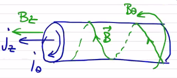
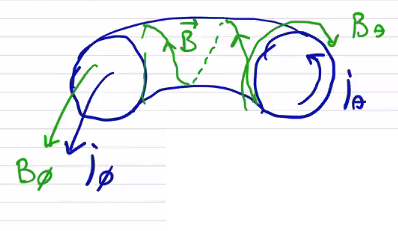

# 2D Equilibria

Let's connect the ends of our 1D equilibria. Doing so is what gives us inherently toroidal configurations. From the 1-dimensional picture:

<p align="center">  </p>

```math
\vec j \cross \vec B = j_\theta B_z - j_z B_\theta \\
= \grad p = \dv{p}{r}
```

we move to a 2-dimensional torus, replacing our cylindrical coordinate system with a toroidal one

<p align="center">  </p>

```math
\vec j \cross \vec B = \vec j_\theta \cross \vec B_\phi + \vec j_\phi \cross \vec B_\theta = \grad p
```

Eventually, the toroidal force balance will lead to the Grad-Shefranov Equation, which tells us how we can solve for a general equilibrium that solves $` \vec j \cross \vec B = \grad p `$.

Let's consider how we might achieve such a configuration. A toroidal magnetic field can be achieved by driving current through a poloidal coil. A more complicated problem is how to drive toroidal current. In general this is done by means of a transformer, where the plasma itself is the secondary circuit. Driving a time-varying current through the primary induces a toroidal current through the plasma. This is called a transformer drive for current.