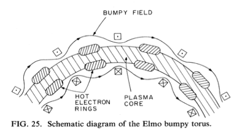
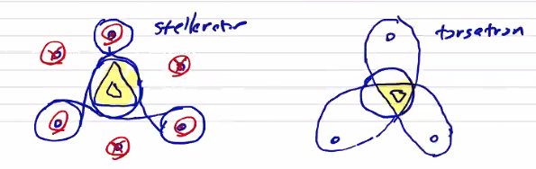

# Equilibrium of 3D Configurations

In 3 dimensions, we lose the axisymmetry that allowed us to reach the Grad-Shefranov equation and we need to solve the full momentum equation in three dimensions. This is not something that we can actually do in this class, and the existing codes that do this are quite sophisticated.

Some general features of 3D equilibria are:

 1. No net toroidal current. This means that they tend to be steady-state configurations.
 2. Radial confinement is accomplished by toroidal fields, as in the end-connected $` \theta `$-pinch. As we saw, toroidal fields cannot provide radial confinement in a purely axisymmetric configuration, but radial variation with $` \phi `$ _can_ provide confinement.
 3. Toroidal effect (radial force balance) is generated by helical magnetic fields. You can do an expansion of the magnetic field into a toroidal component, and a helical component that traces out a twisted shape as you move around the torus. These twisted shapes are what lead to radial confinement.


## ELMO Bumpy Torus (EBT)

In contrast to most other 3D configurations, even though the EBT is a 3D equilibrium, it has no helical windings.

<p align="center">  </p>

Since there are no helical windings, we have to provide radial stability in another way. In the EBT configuration, you also drive hot poloidal electron rings (driven by electron cyclotron resonance) to provide both stability and heating.

## Stellarator

The stellarator configuration is composed of a number of helical current lines (generated by helical coils with _alternating_ currents), and a net toroidal field driven by poloidal coils. The direction of the currents alternate, for a total of $` 2l `$ current lines.

<p align="center">  </p>

The result is a net magnetic field with a ratio such that $` B_{\text{helical}} \gg B_\phi `$ 

Stellarators raise some very complicated engineering challenges both in the design and construction of the complicated geometry. It is also very difficult to maintain no net current within the plasma, especially during start-up. As you add plasma, you raise from zero $` \beta `$ to a finite $` \beta `$, introducing things like bootstrap currents that need to be balanced.

## Torsatron

Similar to a stellarator, the torsatron does not have alternating currents. All of the helical current lines are in the same direction. There are also no toroidal field coils.

The engineering is slightly simpler, but it is slightly less efficient at generating the helical magnetic field.

The flux surfaces in stellarators and torsatrons have geometrical cross-sections depending on the number $` l `$ of helical current lines. About the current lines, the flux surfaces are nearly circular. The flux surfaces within the plasma volume are determined by the separatrix of the helical coil fields.

<p align="center">  </p>

# MHD Stability

Equilibrium is simply a balance of forces that results in a steady state. Beyond equilibrium, stability is the tendency of a perturbation to return to equilibrium, rather than increasing. We are very interested in analyzing the stability of MHD equilibria, including the plasma dynamics, so we need to use the complete ideal MHD model. The MHD equations, which means that any evolution/dynamics are also going to be non-linear. We can define the initial deviation from equilibrium to be a linear phenomenon. As usual, we perform this linearization by letting $` Q(r, t) = Q_0 + Q_1(r, t) `$ with $` Q_1 `$ being a small first-order perturbation. Since the equilibrium is both time and space independent, the general form of the perturbation is

```math
Q_1(r, t) = \vu Q_1 e^{-i (\omega t - \vec k \cdot \vec r)}
```

```math
\grad p_0 = \vec j_0 \cross \vec B_0
```
```math
p = p_0 + p_1 \qquad \rho = \rho_0 + \rho_1
```
```math
\vec j  = \vec j_0 + \vec j_1 \qquad \vec B = \vec B_0 + \vec B_1
```

and for a static equilibrium
```math
\vec v = \vec v_1
```

In our momentum equations of the perturbed quantities, we assume that the static equilibrium holds, so most of the equilibrium terms drop out. We can define a velocity displacement $` \vec \xi = \int_0 ^t \vec v_1 \dd t `$. As we integrate the field and pressure in time,

```math
\pdv{B_1}{t} = \curl (\vec v_1 \cross \vec B_0)
```
```math
\int \pdv{B_1}{t} = \vec B_1 = \curl \int \vec v_1 \cross \vec B_0 \dd t \\
 = \curl (\vec \xi \cross \vec B_0)
```

If we do the same for the pressure equation, we get

```math
p_1 = - \vec \xi \cdot \grad p_0 - \Gamma p_0 \div \vec \xi
```
where $` \Gamma `$ is the ratio of specific heats, to avoid confusion with typical perturbation growth rate $` \gamma `$.

If we combine all of these together, substituting into the momentum equation, we can express the perturbation entirely in terms of $` \vec \xi `$ and the equilibrium properties:

```math
\rho_0 \pdv{ ^2 \vec \xi }{t^2} = \grad (\vec \xi \cdot \grad p_0 + \Gamma p_0 \div \vec \xi)\\
 + \frac{1}{\mu_0} \left[(\curl \vec B_0) \cross \curl (\vec \xi \cross \vec B_0) \right] \\
 + \frac{1}{\mu_0} \left[ \curl \curl ( \vec \xi \cross \vec B_0) \cross \vec B_0 \right]
```

We define the right-hand-side as the linearized forcing function of our equilibrium
```math
\rho_0 \pdv{ ^2 \vec \xi }{t^2} = \vec F(\vec \xi _i , p_0, \vec B_0)
```

For a linear force function, we can also write it in terms of a spring constant tensor

```math
\rho_0 \pdv{ ^2 \vec \xi }{t^2} = \vec F(\vec \xi) = - \overline \vec K \cdot \vec \xi
```